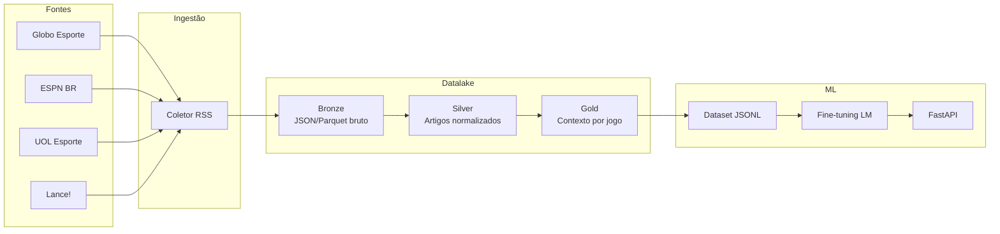

# Datalake de Notícias Esportivas — Bolão LM

Pipeline de coleta, transformação e preparação de dados para treinar uma LM que prevê resultados de bolão (1 / X / 2) com base em notícias dos principais portais esportivos brasileiros.

## Arquitetura



### Camadas

| Camada | Conteúdo | Formato |
|--------|----------|---------|
| **Bronze** | Feed RSS bruto + metadados | Parquet particionado por fonte/data |
| **Silver** | Artigos limpos, times mencionados, sentimento | Parquet |
| **Gold** | Contexto agregado por confronto (bolão) | Parquet + JSONL para treino |

## Fontes (RSS)

Configuradas em **`data/sources.yaml`** — adicione novas fontes sem editar código:

```yaml
sources:
  - id: minha_fonte
    name: Minha Fonte
    url: https://exemplo.com/rss.xml
```

Fontes ativas:

| ID | Portal |
|----|--------|
| `globo_esporte` | Globo Esporte |
| `espn_br` | ESPN Brasil |
| `uol_esporte` | UOL Esporte |
| `fogaonet` | Fogaonet |
| `gazeta_esportiva` | Gazeta Esportiva |

```bash
collect-news --list-sources   # ver todas as fontes ativas
```

> Priorizamos RSS por ser legal, estável e respeitar robots.txt. Scraping de HTML completo é opcional (`--fetch-body`).

## Setup

```bash
python -m venv .venv
source .venv/bin/activate
pip install -e ".[dev]"
cp .env.example .env
```

## Uso

### 1. Coletar notícias (contínuo)

```bash
daily-sync              # coleta + silver (use 2-3x/dia)
collect-news            # só bronze
```

Agende com cron (`scripts/cron_collect.sh`) ou GitHub Actions (`.github/workflows/daily-collect.yml`).

### 2. Importar resultados do Brasileirão (ground truth)

```bash
import-brasileirao                    # temporadas 2022, 2023, 2024
import-brasileirao --seasons 2024     # temporada específica
```

Fonte: [openfootball/south-america](https://github.com/openfootball/south-america) (domínio público).

### 3. Rodar pipeline de transformação

```bash
run-pipeline silver              # bronze → silver
run-pipeline gold --season 2024  # silver + fixtures → gold com labels
run-pipeline export              # exporta JSONL para treino
```

### 4. Palpites da rodada atual

Edite `data/rounds/current.json` com os jogos da rodada e execute:

```bash
predict-round
predict-round --json    # saída JSON
```

Ou via API: `GET /round/predict`

### 5. Exportar dataset para treino

```python
from models.dataset import export_jsonl
export_jsonl("data/training/bolao_train.jsonl")
```

Adicione o campo `label` nos jogos gold (`1`, `X` ou `2`) com resultados históricos antes de treinar.

### 6. Treinar LM

```bash
pip install -e ".[ml]"
python -m models.train
```

Integração recomendada com [Unsloth](https://github.com/unslothai/unsloth) para fine-tuning eficiente.

### 7. Subir API

```bash
uvicorn api.main:app --reload --host 0.0.0.0 --port 8000
```

Endpoints:
- `GET /health` — status
- `POST /context` — contexto de notícias para um jogo
- `POST /predict` — previsão heurística (substituir pela LM treinada)

### 8. Odds reais + EV (Copa)

Configure `ODDS_API_KEY` no `.env` e execute:

```bash
fetch-wc-odds --schedule-file data/rounds/wc_2026.json --output-file data/rounds/wc_2026_odds.json
value-wc-odds --odds-file data/rounds/wc_2026_odds.json --min-edge 0.03
```

Fluxo:
- `fetch-wc-odds` busca odds em tempo real (The Odds API) e sobrescreve o JSON de odds.
- `value-wc-odds` cruza probabilidades do modelo com odds reais e mostra apenas entradas com EV positivo.

### 9. Benchmark de modelos + visual (MLflow)

Para comparar modelos e reduzir erro com validação temporal:

```bash
benchmark-wc-models --eval-season 2022
benchmark-wc-models --eval-season 2022 --mlflow
```

Saídas:
- Relatório JSON em `data/lake/reports/wc_benchmark_report.json`
- Opcional: métricas no MLflow (`accuracy`, `brier`, `log_loss` por modelo)

## Estrutura do projeto

```
api_noticia/
├── ingest/          # Coleta RSS + storage bronze
├── pipelines/       # Transformações silver e gold
├── schemas/         # Contratos Pydantic
├── models/          # Dataset e treino LM
├── api/             # FastAPI
├── tests/
├── config.py
└── data/lake/       # Datalake local (gitignored)
```

## Próximos passos

1. **Ground truth** — importar resultados históricos (Brasileirão, Copa do Brasil) para labels
2. **NER de jogadores** — substituir heurística por modelo de entidades
3. **BigQuery/GCS** — escalar para GCP com `pip install -e ".[gcp]"`
4. **Orquestração** — Prefect ou Cloud Composer para coleta diária
5. **Fine-tuning** — conectar Unsloth ao JSONL gold
6. **Odds e estatísticas** — enriquecer gold com APIs esportivas (API-Football, etc.)

## Formato bolão

| Código | Significado |
|--------|-------------|
| `1` | Vitória do mandante |
| `X` | Empate |
| `2` | Vitória do visitante |

## Licença

Uso interno / pesquisa. Respeite os termos de uso dos portais de notícias.
