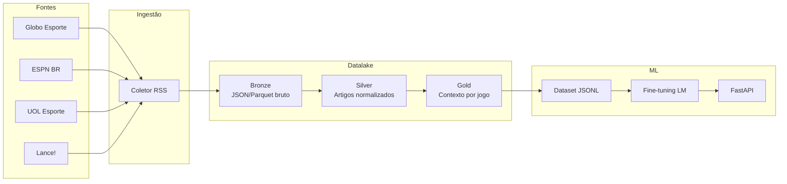

# Datalake de Notícias Esportivas — Bolão AI

Pipeline de coleta, transformação e previsão de resultados de bolão (**1 / X / 2**) com notícias esportivas, modelos estatísticos (Dixon-Coles + logística), motor tático **KXL** e interface web React.

## Documentação completa

**Índice central:** [docs/README.md](docs/README.md)

| Guia | Descrição |
|------|-----------|
| [Visão geral](docs/visao-geral.md) | Objetivo, fluxos, capacidades |
| [Arquitetura](docs/arquitetura.md) | Camadas, pastas, integrações |
| [Instalação](docs/instalacao-e-configuracao.md) | Setup, `.env`, troubleshooting |
| [API REST](docs/api-referencia.md) | Todos os endpoints + exemplos |
| [Modelos ML](docs/modelos-preditivos.md) | Dixon-Coles, logística, KXL, EV |
| [Datalake](docs/datalake-e-pipelines.md) | Pipelines e CLIs |
| [Frontend](docs/frontend.md) | UI React, rotas, componentes |
| [KXL Colisão](docs/kxl-colisao.md) | Fórmulas táticas detalhadas |
| [Glossário](docs/glossario.md) | Termos e siglas |

## Início rápido

```bash
pip install -e ".[dev]"
cp .env.example .env
import-world-cup --missing-only
./scripts/dev-api.sh          # terminal 1
cd frontend && npm run dev    # terminal 2
```

- API: http://localhost:8000/docs  
- UI: http://localhost:5173  

## Arquitetura



### Camadas

| Camada | Conteúdo | Formato |
|--------|----------|---------|
| **Bronze** | Feed RSS bruto + metadados | Parquet particionado por fonte/data |
| **Silver** | Artigos limpos, times mencionados, sentimento | Parquet |
| **Gold** | Contexto agregado por confronto (bolão) | Parquet + JSONL para treino |

## Fontes (RSS)

Configuradas em **`data/sources.yaml`** — adicione novas fontes sem editar código:

```yaml
sources:
  - id: minha_fonte
    name: Minha Fonte
    url: https://exemplo.com/rss.xml
```

Fontes ativas:

| ID | Portal |
|----|--------|
| `globo_esporte` | Globo Esporte |
| `espn_br` | ESPN Brasil |
| `uol_esporte` | UOL Esporte |
| `fogaonet` | Fogaonet |
| `gazeta_esportiva` | Gazeta Esportiva |

```bash
collect-news --list-sources   # ver todas as fontes ativas
```

> Priorizamos RSS por ser legal, estável e respeitar robots.txt. Scraping de HTML completo é opcional (`--fetch-body`).

## Setup

```bash
python -m venv .venv
source .venv/bin/activate
pip install -e ".[dev]"
cp .env.example .env
```

## Uso

### 1. Coletar notícias (contínuo)

```bash
daily-sync              # coleta + silver (use 2-3x/dia)
collect-news            # só bronze
```

Agende com cron (`scripts/cron_collect.sh`) ou GitHub Actions (`.github/workflows/daily-collect.yml`).

### 2. Importar resultados do Brasileirão (ground truth)

```bash
import-brasileirao                    # temporadas 2022, 2023, 2024
import-brasileirao --seasons 2024     # temporada específica
```

Fonte: [openfootball/south-america](https://github.com/openfootball/south-america) (domínio público).

### 2b. Base histórica da Copa do Mundo

```bash
import-world-cup --list              # edições na fonte vs lake local
import-world-cup --missing-only      # importa só o que falta (1930–2022)
import-world-cup --seasons 1970 1982 2022
import-world-cup --force             # reimporta todas as edições
```

Fonte: [openfootball/worldcup](https://github.com/openfootball/worldcup) (1930 a 2022). Após importar, **reinicie a API** para os modelos WC recarregarem os jogos.

### 2c. Baselines táticos KXL (Copa 2026)

Perfis vetoriais por seleção em `data/wc/team_baselines.json` (48 times). O palpite WC mistura 75% ensemble histórico + 25% DNA KXL e inclui matchup setorial no `context`.

```bash
python3 scripts/import_wc_baselines.py "/caminho/DADOS PARCEIAIS ... COPA.txt"
```

**Fase 3 — motor de colisão:** `pipelines/wc_kxl_collision.py` e fórmulas em [docs/kxl-colisao.md](docs/kxl-colisao.md) (Vcar, Vesc, TBRTL, colisão setorial, **letalidade×GK** cabeça/fora/área/BP, **EACP**). UI: gramado interativo + painel Letalidade×Goleiro.

**Fase 2 — entrada dinâmica (opcional no `POST /worldcup/predict`):** exemplo completo em `data/wc/kxl_match_example.json`. Campos alinhados ao PDF: `previsao_chuva_pct`, `estado_gramado`, `mandante_titulares_notas` (goleiro/defensores/meio/atacantes), `impacto_nota_elenco`, `contexto_peso_caos`.

```json
{
  "home_team": "Brasil",
  "away_team": "Marrocos",
  "phase": "group",
  "kxl_match": {
    "fecl": { "previsao_chuva_pct": 55, "estado_gramado": "Molhado" },
    "feju": { "perfil": "punitivista", "indice_cartao_falta": 0.28 },
    "fede": {
      "desfalques_visitante": [
        { "jogador": "Ziyech", "impacto_nota_elenco": -0.8 }
      ]
    },
    "fept": {
      "esquema_mandante": "4-3-3",
      "mandante_titulares_notas": {
        "goleiro": { "nome": "Alisson", "nota_sofascore": 7.1 },
        "atacantes": [{ "nome": "Vini Jr", "nota_sofascore": 7.9 }]
      }
    },
    "feem": { "contexto_peso_caos": 1.25, "jogo_decisivo": true }
  }
}
```

**Calibração holdout (ensemble vs blend KXL 25%):**

```bash
python3 scripts/wc_kxl_calibrate.py --season 2022
```

### 3. Rodar pipeline de transformação

```bash
run-pipeline silver              # bronze → silver
run-pipeline gold --season 2024  # silver + fixtures → gold com labels
run-pipeline export              # exporta JSONL para treino
```

### 4. Palpites da rodada atual

Edite `data/rounds/current.json` com os jogos da rodada e execute:

```bash
predict-round
predict-round --json    # saída JSON
```

Ou via API: `GET /round/predict`

### 5. Exportar dataset para treino

```python
from models.dataset import export_jsonl
export_jsonl("data/training/bolao_train.jsonl")
```

Adicione o campo `label` nos jogos gold (`1`, `X` ou `2`) com resultados históricos antes de treinar.

### 6. Treinar LM

```bash
pip install -e ".[ml]"
python -m models.train
```

Integração recomendada com [Unsloth](https://github.com/unslothai/unsloth) para fine-tuning eficiente.

### 7. Subir API

```bash
uvicorn api.main:app --reload --host 0.0.0.0 --port 8000
```

Endpoints principais (detalhes em [docs/api-referencia.md](docs/api-referencia.md)):

- `GET /health` — status
- `GET /news/feed`, `POST /news/sync` — notícias
- `POST /context`, `POST /predict` — Brasileirão + notícias
- `GET /round/predict` — rodada Brasileirão
- `POST /worldcup/predict` — palpite WC (ensemble + KXL opcional)
- `GET /worldcup/round`, `GET /worldcup/teams` — rodada e seleções
- `GET /worldcup/editions`, `POST /worldcup/validate` — backtest histórico
- `POST /worldcup/value/live` — value bets (requer `ODDS_API_KEY`)

### 8. Frontend web

```bash
cd frontend && npm install && npm run dev
```

Ver [docs/frontend.md](docs/frontend.md).

### 9. Odds reais + EV (Copa)

Configure `ODDS_API_KEY` no `.env` e execute:

```bash
fetch-wc-odds --schedule-file data/rounds/wc_2026.json --output-file data/rounds/wc_2026_odds.json
value-wc-odds --odds-file data/rounds/wc_2026_odds.json --min-edge 0.03
```

Fluxo:
- `fetch-wc-odds` busca odds em tempo real (The Odds API) e sobrescreve o JSON de odds.
- `value-wc-odds` cruza probabilidades do modelo com odds reais e mostra apenas entradas com EV positivo.

### 10. Benchmark de modelos + visual (MLflow)

Para comparar modelos e reduzir erro com validação temporal:

```bash
benchmark-wc-models --eval-season 2022
benchmark-wc-models --eval-season 2022 --mlflow
mlflow-ui
```

Saídas:
- Relatório JSON em `data/lake/reports/wc_benchmark_report.json`
- Opcional: métricas no MLflow (`accuracy`, `brier`, `log_loss` por modelo), experimento `api-noticia/wc-benchmark` em `mlflow.db`

Use sempre `mlflow-ui` (não `mlflow ui` puro) para a UI ler o mesmo backend SQLite do benchmark. URL padrão: http://127.0.0.1:5001 (porta 5001 evita conflito com AirPlay no macOS).

## Estrutura do projeto

```
api_noticia/
├── ingest/          # Coleta RSS + storage bronze + odds
├── pipelines/       # Transformações silver, gold, WC, KXL
├── schemas/         # Contratos Pydantic
├── models/          # Dixon-Coles, logística, baseline, EV
├── api/             # FastAPI
├── frontend/        # React + TypeScript (Bolão AI)
├── docs/            # Documentação detalhada
├── tests/
├── config.py
└── data/lake/       # Datalake local (gitignored)
```

## Próximos passos

1. **Ground truth** — importar resultados históricos (Brasileirão, Copa do Brasil) para labels
2. **NER de jogadores** — substituir heurística por modelo de entidades
3. **BigQuery/GCS** — escalar para GCP com `pip install -e ".[gcp]"`
4. **Orquestração** — Prefect ou Cloud Composer para coleta diária
5. **Fine-tuning** — conectar Unsloth ao JSONL gold
6. **Odds e estatísticas** — enriquecer gold com APIs esportivas (API-Football, etc.)

## Formato bolão

| Código | Significado |
|--------|-------------|
| `1` | Vitória do mandante |
| `X` | Empate |
| `2` | Vitória do visitante |

## Licença

Uso interno / pesquisa. Respeite os termos de uso dos portais de notícias.
