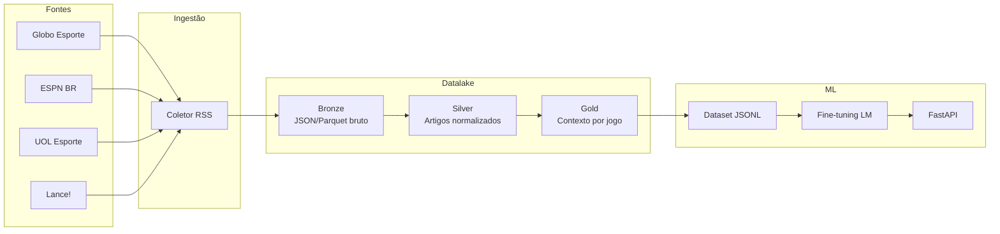

---

## title: api-noticia
emoji: 📈
colorFrom: blue
colorTo: green
sdk: docker
pinned: false

# Datalake de Notícias Esportivas — Bolão LM

Pipeline de coleta, transformação e preparação de dados para treinar uma LM que prevê resultados de bolão (1 / X / 2) com base em notícias dos principais portais esportivos brasileiros.

## Arquitetura




### Camadas


| Camada     | Conteúdo                                      | Formato                             |
| ---------- | --------------------------------------------- | ----------------------------------- |
| **Bronze** | Feed RSS bruto + metadados                    | Parquet particionado por fonte/data |
| **Silver** | Artigos limpos, times mencionados, sentimento | Parquet                             |
| **Gold**   | Contexto agregado por confronto (bolão)       | Parquet + JSONL para treino         |


## Fontes (RSS)

Configuradas em `**data/sources.yaml`** — adicione novas fontes sem editar código:

```yaml
sources:
  - id: minha_fonte
    name: Minha Fonte
    url: https://exemplo.com/rss.xml
```

Fontes ativas:


| ID                 | Portal           |
| ------------------ | ---------------- |
| `globo_esporte`    | Globo Esporte    |
| `espn_br`          | ESPN Brasil      |
| `uol_esporte`      | UOL Esporte      |
| `fogaonet`         | Fogaonet         |
| `gazeta_esportiva` | Gazeta Esportiva |


```bash
collect-news --list-sources   # ver todas as fontes ativas
```

> Priorizamos RSS por ser legal, estável e respeitar robots.txt. Scraping de HTML completo é opcional (`--fetch-body`).

## Setup

```bash
python -m venv .venv
source .venv/bin/activate
pip install -e ".[dev]"
cp .env.example .env
```

## Uso

### 1. Coletar notícias (contínuo)

```bash
daily-sync              # coleta + silver (use 2-3x/dia)
collect-news            # só bronze
```

Agende com cron (`scripts/cron_collect.sh`) ou GitHub Actions (`.github/workflows/daily-collect.yml`).

**CI:** em cada push/PR, o workflow `.github/workflows/ci.yml` roda testes, `import-fixtures` (Brasileirão 2022–2024) e `benchmark-bolao-models --eval-season 2024`.

### 2. Importar resultados históricos (ground truth)

```bash
import-fixtures                              # Brasileirão + Copa do Brasil
import-fixtures --competition brasileirao --seasons 2024
import-fixtures --competition copa --seasons 2025
```

Alias: `import-brasileirao` (mesmo comando).

Fonte: [openfootball/south-america](https://github.com/openfootball/south-america) (domínio público).

### 3. Rodar pipeline de transformação

```bash
run-pipeline silver              # bronze → silver
run-pipeline gold --season 2024  # silver + fixtures → gold com labels
run-pipeline export              # exporta JSONL para treino
```

### 4. Palpites da rodada atual

Edite `data/rounds/current.json` com os jogos da rodada e execute:

```bash
predict-round
predict-round --json    # saída JSON
```

Ou via API: `GET /round/predict`

### 5. Exportar dataset para treino

```python
from models.dataset import export_jsonl
export_jsonl("data/training/bolao_train.jsonl")
```

Adicione o campo `label` nos jogos gold (`1`, `X` ou `2`) com resultados históricos antes de treinar.

### 6. Treinar LM (Unsloth + JSONL gold)

```bash
run-pipeline export
pip install -e ".[unsloth]"
train-bolao --unsloth
# ou: python scripts/unsloth_train.py --export-first
```

Sem GPU local: use `scripts/hf_sft_train.py` no Hugging Face Jobs.

### 6b. NER de jogadores (silver)

```bash
pip install -e ".[ner]"
# .env: NER_ENABLED=true
daily-sync
```

### 6c. GCP (BigQuery + GCS)

```bash
pip install -e ".[gcp]"
# .env: GCP_PROJECT, GCS_BUCKET, BQ_DATASET
sync-gcp --layer all
```

### 6d. Orquestração diária (Prefect)

```bash
pip install -e ".[orchestration]"
run-daily-flow
```

Para Cloud Composer, reutilize as mesmas tasks (`collect` + `run_silver_pipeline`).

### 6e. Enriquecer gold (API-Football)

```bash
# .env: API_FOOTBALL_KEY=
enrich-gold --limit 50
```

### 7. Subir API

```bash
uvicorn api.main:app --reload --host 0.0.0.0 --port 8000
```

Endpoints:

- `GET /health` — status do lake + predictor (`baseline` ou `lm`)
- `POST /context` — contexto de notícias para um jogo
- `POST /predict` — palpite com probabilidades 1/X/2 (`model_source`, `probabilities`)
- `GET /round/predict` — palpites da rodada em `data/rounds/current.json`

Com checkpoint treinado (`train-bolao --unsloth`), a API carrega automaticamente de `models/checkpoints/bolao-unsloth`. Sem modelo, usa baseline heurístico.

### 8. Importar histórico da Copa do Mundo (até 20 edições)

Fonte: [openfootball/worldcup](https://github.com/openfootball/worldcup) (1930–2022, 22 edições).

```bash
import-world-cup --list              # ver todas as edições
import-world-cup                     # últimas 20 Copas (default)
import-world-cup --all               # todas as 22 edições
import-world-cup --seasons 1994 2002 2014 2022
```

Arquivos em `data/lake/fixtures/world_cup_{ano}.parquet` com labels 1/X/2, fase e grupo.

**Base de validação (Copa):** `data/lake/fixtures/world_cup_2022.parquet` — 64 jogos do Qatar 2022. Treino usa todas as edições com `season < 2022`; avaliação só em 2022 (sem vazamento temporal). Configurável via `WC_VALIDATION_SEASON` no `.env`.

### 9. Odds reais + EV (Copa)

Configure `ODDS_API_KEY` no `.env` e execute:

```bash
fetch-wc-odds --schedule-file data/rounds/wc_2026.json --output-file data/rounds/wc_2026_odds.json
value-wc-odds --odds-file data/rounds/wc_2026_odds.json --min-edge 0.03
```

Fluxo:

- `fetch-wc-odds` busca odds em tempo real (The Odds API) e sobrescreve o JSON de odds.
- `value-wc-odds` cruza probabilidades do modelo com odds reais e mostra apenas entradas com EV positivo.

### 10. Benchmark Brasileirão (validação temporal)

```bash
import-fixtures --competition brasileirao --seasons 2022 2023 2024
benchmark-bolao-models --eval-season 2024
benchmark-bolao-models --eval-season 2024 --mlflow
```

Relatório em `data/lake/reports/brasileirao_benchmark_report.json` (baseline, logistic, GB calibrado — sem vazamento de futuro).

### 11. Benchmark de modelos Copa (MLflow)

Para comparar modelos e reduzir erro com validação temporal:

```bash
benchmark-wc-models --eval-season 2022
benchmark-wc-models --eval-season 2022 --mlflow
```

Saídas:

- Relatório JSON em `data/lake/reports/wc_benchmark_report.json`
- Opcional: métricas no MLflow (`accuracy`, `brier`, `log_loss` por modelo)

## Estrutura do projeto

```
api_noticia/
├── ingest/          # Coleta RSS + storage bronze
├── pipelines/       # Transformações silver e gold
├── schemas/         # Contratos Pydantic
├── models/          # Dataset e treino LM
├── api/             # FastAPI
├── tests/
├── config.py
└── data/lake/       # Datalake local (gitignored)
```

## Marco teórico (onde cada ideia entra)

| Conceito | Onde no projeto | Comando / módulo |
|----------|-----------------|------------------|
| **Lei dos grandes números** | Métricas só confiáveis com muitos jogos; IC por bootstrap; calibração no holdout | `study-wc-calibration`, `benchmark-wc-models` (aviso se n&lt;30) |
| **Lei de Coase** | Edge mínimo = margem da casa + custo fixo antes de recomendar aposta EV+ | `value-wc-odds` via `models/economics.coase_effective_min_edge` |
| **Dixit-Stiglitz (CES)** | Combinar Poisson + logística (+ GB no benchmark) como “variedades” substituíveis | `WcPredictor`, `models/economics.ces_blend_probabilities` |

Parâmetros em `.env`: `LGN_MIN_SAMPLES`, `COASE_BOOKMAKER_MARGIN`, `DIXIT_SIGMA`.

## Roadmap (implementado)


| Item                              | Comando / módulo                                       |
| --------------------------------- | ------------------------------------------------------ |
| Ground truth (Brasileirão + Copa) | `import-fixtures`                                      |
| NER de jogadores                  | `pip install -e ".[ner]"` + `NER_ENABLED=true`         |
| BigQuery/GCS                      | `pip install -e ".[gcp]"` + `sync-gcp`                 |
| Orquestração                      | `pip install -e ".[orchestration]"` + `run-daily-flow` |
| Fine-tuning Unsloth               | `train-bolao --unsloth`                                |
| Odds + stats                      | `fetch-wc-odds`, `enrich-gold` (API-Football)          |


## Formato bolão


| Código | Significado          |
| ------ | -------------------- |
| `1`    | Vitória do mandante  |
| `X`    | Empate               |
| `2`    | Vitória do visitante |


## Licença

Uso interno / pesquisa. Respeite os termos de uso dos portais de notícias.