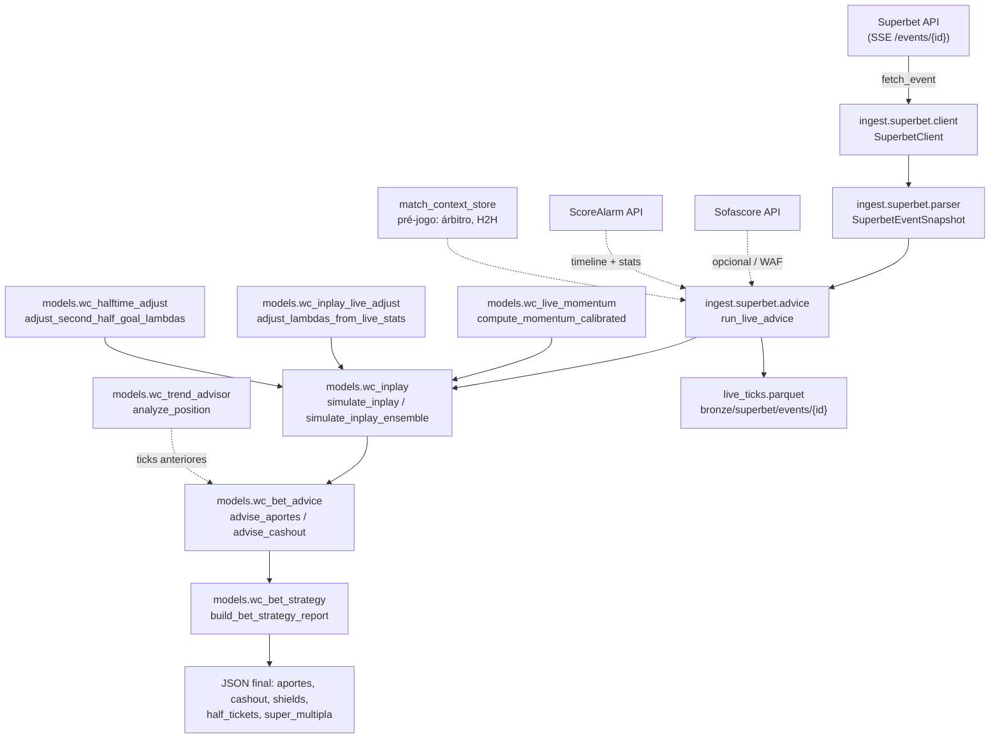

# Análise Técnica: Modelo In-Play / Ao Vivo — Precisão e Separação do Projeto

> Data da análise: 2026-06-21  
> Escopo: `/Users/amaro/Documents/Cactus/api_noticia`  
> Arquivos analisados: `models/wc_inplay.py`, `models/wc_bet_advice.py`, `models/wc_bet_strategy.py`, `models/wc_inplay_live_adjust.py`, `models/wc_inplay_gbm.py`, `models/wc_inplay_ensemble.py`, `models/wc_inplay_h2h_adjust.py`, `models/wc_trend_advisor.py`, `models/wc_live_momentum.py`, `ingest/superbet/advice.py`, `ingest/superbet/parser.py`, `ingest/superbet/client.py`, `pipelines/poll_superbet_live.py`, `docs/analise-inplay-backend.md`, `config.py` e módulos complementares (`wc_halftime_adjust`, `wc_market_shrinkage`, `wc_inplay_coefficients`, `wc_intensity_profile`, `wc_hawkes`, `wc_inplay_walkforward`, `inplay_market_period`, `inplay_dead_market`).

---

## 1. Resumo Executivo

### Pergunta 1: Vale a pena separar o projeto ao vivo do resto do projeto?

**Resposta direta: Sim, mas parcialmente.**

O modelo ao vivo **não deveria ficar no mesmo pacote de código, mesmas configurações e mesmo ciclo de release** do modelo pré-jogo, porque:

1. **Cadência diferente**: pré-jogo é batched, treinado uma vez por dia/semana; ao vivo é stream, SLA de segundos, depende de cache, fallback e resiliência.
2. **Fontes de dados diferentes**: pré-jogo vive de fixtures, Elo, xG histórico; ao vivo vive de SSE Superbet, Sofascore, ScoreAlarm, ticks anteriores e reconciliação.
3. **Métricas diferentes**: pré-jogo é Brier/ROI em amostras grandes; ao vivo é latência, staleness, hit rate por minuto, cash-out correto.
4. **Risco operacional**: um bug no ao vivo gera recomendações ruins em segundos e queima dinheiro real. Isolar permite rollback independente, circuit breakers e deploy separado.

**Mas não precisa ser um repo totalmente novo no dia 1.** O caminho pragmático é:

- Extrair **logo** um pacote `live/` ou serviço `live-service/` com fronteira clara.
- Manter, num primeiro momento, **leitura somente** do modelo pré-jogo treinado (o `wc_predictor.pkl`).
- Deixar o resto do projeto (`api_noticia`) como "plataforma de treino e dados", e o ao vivo como "serviço de inferência e recomendação".

**Recomendação**: **separar em serviço/módulo independente dentro de 1–2 sprints**, começando pela extração do orquestrador `ingest/superbet/advice.py` e do pipeline `poll_superbet_live.py`.

---

### Pergunta 2: O que precisa ser feito para o modelo ao vivo funcionar com precisão?

**Resposta direta: O núcleo Poisson/Monte Carlo é matematicamente razoável, mas está atolado em heurísticas mal calibradas, features ao vivo subutilizadas e um ensemble que mistura componentes de forma ingênua. A precisão depende mais de ENGENHARIA DE DADOS AO VIVO e CALIBRAÇÃO do que de mais modelos.**

As 3 alavancas de maior impacto são:

1. **Feature set ao vivo de verdade**: xG acumulado, chutes, grandes chances, posse em campo adversário, substituições, lesões, expulsões. Hoje o modelo usa proxy fraca (escanteios + posse + SOT do overview).
2. **Calibrar os multiplicadores de momentum e o NHPP com dados reais**: os β's do MLE (`wc_inplay_coefficients`) e os pesos NHPP (`wc_intensity_profile`) são treinados com fixtures históricas, não com ticks reais da Superbet. Sem live_ticks de qualidade, a calibração é ilusória.
3. **Reformular o ensemble**: o blend Poisson + Hawkes + GBM + mercado (`wc_inplay_ensemble`) usa pesos fixos por bucket de 15 minutos, sem validação cruzada, sem recalibração e com um GBM que quase nunca está treinado (`InPlayGBMModel.load()` retorna instância não-treinada se o pickle não existe).

O modelo **funciona** hoje como "modelo de referência condicionado ao placar". Para funcionar com **precisão comercial**, precisa de um pipeline de dados ao vivo robusto, métricas de validação contínua e uma camada de fusão de evidências bem calibrada.

---

## 2. Arquitetura Atual do Ao Vivo

### 2.1. Diagrama de fluxo de dados (Mermaid)



### 2.2. Diagrama interno do `simulate_inplay` (sequência de ajustes de λ)

```
λ_pré-jogo (goal_model_factors)
        │
        ▼
Bayesian update com gols observados (Gamma-Poisson, prior_weight=5)
        │
        ▼
Ajuste por live_stats (posse, SOT) — max_shift=12%
        │
        ▼
Ajuste H2H (comeback boost + over/under calibration)
        │
        ▼
Favorito perdendo por 1 gol → hard cap na reação adversária
        │
        ▼
Score-diff adjust (legado, desligado por padrão, ativo com Sofascore/ScoreAlarm)
        │
        ▼
Market shrinkage (mistura λ_model com λ_implícito do mercado)
        │
        ▼
Cálculo λ_remaining via NHPP ou fração linear
        │
        ▼
Halftime adjust (se minute > 45 e stats congeladas disponíveis)
        │
        ▼
Trailing chase boost (reação pós-gol na timeline)
        │
        ▼
Momentum sobre λ_remaining (placar, minuto, cartões, subs, escanteios)
        │
        ▼
Monte Carlo Poisson bivariado → probabilidades de mercado
```

### 2.3. Componentes principais

| Módulo | Função | Entradas | Saídas |
|---|---|---|---|
| `wc_inplay.py` | Motor Monte Carlo in-play | placar, minuto, λ pré-jogo, eventos, stats | probs 1X2, next_goal, totais, handicaps, scores |
| `wc_bet_advice.py` | Gera aportes EV+ e cash-out | snapshot Superbet, probs do modelo, aposta aberta | lista de aportes, advice de cash-out |
| `wc_bet_strategy.py` | Postura, shields, correlação, hedge | aportes, cashout, minuto, benchmark | relatório de estratégia |
| `wc_live_momentum.py` | Multiplicadores de λ por contexto tático | placar, minuto, eventos, escanteios | home_factor / away_factor |
| `wc_inplay_live_adjust.py` | Ajuste por posse/SOT e trailing chase | live_stats, timeline ScoreAlarm | λ ajustado + metadados |
| `wc_inplay_h2h_adjust.py` | Comeback boost e calibração por histórico direto | match_context.h2h | fatores λ e draw_penalty |
| `wc_trend_advisor.py` | Copiloto de tendência via série de ticks | ticks JSON do evento | sinais + position_advice |
| `wc_inplay_ensemble.py` | Blend dinâmico Poisson/Hawkes/GBM/mercado | probs de cada fonte | probs 1X2 ponderadas |
| `wc_halftime_adjust.py` | Recalibração do 2T com stats do 1T | placar HT, escanteios, cartões | fatores λ_2h + corners/cards |
| `ingest/superbet/advice.py` | Orquestração ao vivo | event_id, predictor, config | payload final completo |
| `poll_superbet_live.py` | Loop de captura contínua | config | live_ticks.parquet |

---

## 3. Pontos Fortes do Modelo Atual

1. **Base probabilística sólida**: Poisson bivariado com Dixon-Coles ρ e Monte Carlo de 5k simulações é um ponto de partida correto para futebol.
2. **Bayesian update de λ com gols**: a atualização Gamma-Poisson (`bayesian_lambda_update`) é matematicamente coerente e evita overreaction a gols isoluados pelo `prior_weight=5` e clip 0.3×–2.5×.
3. **Override determinístico de linhas garantidas**: `_apply_guaranteed_lines` evita recomendar Under 2.5 quando já há 3 gols — detalhe óbvio, mas essencial.
4. **NHPP para decaimento temporal**: o perfil de intensidade não-homogêneo (`wc_intensity_profile`) incorpora o fato empírico de que gols são mais frequentes no final do jogo.
5. **Market shrinkage com decaimento**: a mistura λ_model × λ_market com α decaindo de 0.70 para 0.30 ao longo do jogo é uma ideia economicamente sensata (o mercado sabe de escalações; o modelo sabe do placar).
6. **Blindagens de negócio robustas**: time decay, late-game gates, bloqueio de mercados mortos, correlation warnings, hedge suggestions, shields de handicap agressivo e generosity block (<5%) protegem o usuário de erros grosseiros.
7. **Cache e resiliência**: `run_with_advice_cache`, stale fallback, cooldown da Sofascore, watchlist de eventos e finalização automática mostram preocupação operacional.
8. **Estrutura de dados longitudinal**: `live_ticks.parquet`, eventos por diretório e `score_stale` permitem, em tese, benchmarking e retreino contínuo.
9. **H2H adjust**: embora os thresholds sejam arbitrários, a ideia de usar histórico direto para âncora de reação é válida para jogos de seleções com poucos dados.
10. **Trend advisor**: `wc_trend_advisor` é um copiloto útil para cash-out, usando sequência de ticks ao invés de apenas probabilidade estática.

---

## 4. Gaps de Precisão (12 identificados)

### 4.1. GBM in-play quase sempre inoperante

- **Onde**: `models/wc_inplay_gbm.py`, `models/wc_inplay_ensemble.py` (linhas 1150–1187).
- **Problema**: o modelo GBM é carregado via `InPlayGBMModel.load()`. Se `data/lake/artifacts/inplay_gbm.pkl` não existe, retorna instância não-treinada e o ensemble desliga o componente.
- **Impacto**: uma das 4 pernas do ensemble (e a única com features de estado ricas) raramente contribui. O ensemble vira um blend Poisson/Hawkes/mercado, ou pior, Poisson puro.
- **Causa raiz**: não há pipeline claro de treino do GBM com labels reais de "próximo gol nos próximos 10 minutos" derivados dos live_ticks.

### 4.2. Pesos do ensemble são fixos e não validados

- **Onde**: `models/wc_inplay_ensemble.py`, `EnsembleWeights`.
- **Problema**: os pesos `[poisson, hawkes, gbm, market]` por bucket de 15 minutos são hard-coded. Não há otimização de stacking, regressão de LogLoss ou validação cruzada.
- **Impacto**: o ensemble pode estar pior do que o melhor componente isolado. Pesos ingênuos médiam erros em vez de cancelá-los.
- **Exemplo**: bucket 0–15 dá 40% de peso ao mercado, mas o mercado ao vivo dos primeiros minutos pode ter liquidez baixa e margem alta.

### 4.3. Hawkes usa parâmetros literários não calibrados

- **Onde**: `models/wc_hawkes.py` (`alpha_self=0.08`, `alpha_cross=0.12`, `beta=0.25`); `wc_inplay.py` linhas 1103–1147.
- **Problema**: os parâmetros são default da literatura. Não há evidência de que eles sejam válidos para seleções/Copa ou para o feed da Superbet.
- **Impacto**: o efeito de clustering pós-gol pode ser superestimado ou subestimado. No limite, o Hawkes introduz ruído.

### 4.4. Momentum calibrado é treinado em fixtures, não em ticks reais

- **Onde**: `pipelines/wc_inplay_tune.py` (`fit_momentum_mle`), `models/wc_inplay_coefficients.py`.
- **Problema**: o MLE treina em `build_timeline_from_fixtures` (jogos históricos da Copa) e opcionalmente concatena live_ticks. Mas a feature matrix usa apenas `goal_diff`, `late_game`, red cards e corner_share.
- **Impacto**: os β's não aprendem com xG, pressão real, substituições ou momentum de mercado. O "calibrado" pode ser apenas um overfit suave em dados históricos esparsos.
- **Agravante**: `inplay_use_calibrated_nhpp=false` por padrão, então o NHPP raramente é calibrado.

### 4.5. Live stats λ adjust é uma regra linear muito simples

- **Onde**: `models/wc_inplay_live_adjust.py` (`adjust_lambdas_from_live_stats`).
- **Problema**: posse de bola e chutes no gol são convertidos em shift via constantes `0.08` e `0.03`, sem interação, sem normalização por minuto, sem qualidade do chute.
- **Impacto**: um time com 70% de posse mas 0 chutes no gol recebe boost λ; um time com pouca posse mas grandes chances perdidas é penalizado.
- **Simplificação crítica**: não usa xG acumulado ao vivo, que é o melhor predictor de gols futuros.

### 4.6. xG ao vivo é subutilizado

- **Onde**: `ingest/superbet/advice.py` linhas 295–330; `config.py` (`inplay_use_sofascore_live=true`).
- **Problema**: `live_stats` pode conter `home_xg`/`away_xg`, mas o modelo não faz blending sistemático de xG com λ. O xG pré-jogo entra via `wc_xg_lambda_blend_enabled`, mas o xG acumulado do jogo não recalibra λ ao vivo.
- **Impacto**: o modelo ignora a informação mais poderosa disponível. Um time pode estar perdendo 0×1 com 2.5 xG — o modelo vê apenas 0×1.

### 4.7. Substituições não são integradas

- **Onde**: `models/wc_live_momentum.py` tem o evento `sub_offensive`/`sub_defensive`, mas em `ingest/superbet/advice.py` não há parser de substituições da Sofascore/ScoreAlarm.
- **Problema**: o momentum considera apenas gols, cartões vermelhos e escanteios. Substituir um volante por um atacante muda λ de forma material.
- **Impacto**: o modelo erra o timing de reação de times que buscam o resultado.

### 4.8. Trailing chase boost é regra arbitrária

- **Onde**: `models/wc_inplay_live_adjust.py` (`apply_trailing_chase_boost`), linhas 129–186.
- **Problema**: boost de 4% + 2% por gol de déficit, janela de 15 minutos, sem calibração por força do time, minuto ou placar.
- **Impacto**: superestima reação de azarões e subestima reação de favoritos. Pode gerar apostas em "próximo gol do time perdendo" que não têm edge.

### 4.9. Market shrinkage converte probabilidades 1X2 em λ de forma heurística

- **Onde**: `models/wc_market_shrinkage.py` (`market_prob_to_lambda`).
- **Problema**: a conversão usa `-ln(P(não-domina)) × 1.35`, uma aproximação fraca que ignora correlação entre gols e empate.
- **Impacto**: o λ "de mercado" pode estar sistematicamente enviesado. A mistura de um λ errado com o λ_model dilui a qualidade do modelo em vez de melhorá-la.
- **Sugestão**: o shrinkage deveria atuar nas probabilidades 1X2 diretamente, não em λ.

### 4.10. Próximo gol usa proporção λ estática

- **Onde**: `models/wc_inplay.py` linhas 798–804.
- **Problema**: `p_next_home = (lam_h / lam_sum) × p_any` assume que, dado que haverá um gol, a probabilidade de cada time marcar segue a força pré-jogo ajustada.
- **Impacto**: ignora que o time na frente pode recuar e o time atrás pressiona. A direção do próximo gol é mal estimada, especialmente após expulsões e substituições.

### 4.11. Projeções de escanteios e cartões dependem de λ fracos

- **Onde**: `models/wc_halftime_adjust.py` (`project_live_corners`, `project_halftime_cards`).
- **Problema**: corners usam prior genérico `lambda_full * 2.2` se não houver corner_lambda; cartões usam prior fixo `3.8` amarelos/jogo se não houver árbitro.
- **Impacto**: mercados de escanteios e cartões são oferecidos ao usuário com probabilidades baseadas em priors genéricos, não calibrados por time/estilo/árbitro.

### 4.12. Falta validação contínua em produção

- **Onde**: `pipelines/inplay_benchmark.py`.
- **Problema**: o benchmark é manual (`benchmark-inplay --verbose`). Não há dashboard automático de Brier por minuto, delta vs mercado, hit rate de cash-outs e drift dos pesos do ensemble.
- **Impacto**: o modelo pode estar degradando silenciosamente. Sem feedback em tempo real, não há como saber se uma mudança melhorou ou piorou.

---

## 5. Avaliação: Separar ou Não?

### 5.1. Prós da separação

| Pró | Explicação |
|---|---|
| **Ciclo de deploy independente** | Bugs ao vivo podem ser revertidos sem tocar no pré-jogo. |
| **Escalabilidade diferente** | O ao vivo precisa de cache, filas e workers leves; o pré-jogo precisa de batch e GPU/CPU pesada. |
| **Métricas isoladas** | Brier ao vivo, latência, staleness, P&L de cash-out não se misturam com métricas de treino. |
| **Responsabilidade clara** | Um time/time pode "dono" do ao vivo, outro do pré-jogo. |
| **Testes de integração real** | É possível simular um jogo completo com feed de teste sem carregar todo o projeto. |
| **Tecnologias distintas** | Ao vivo pode usar Redis/Streamlit/FastAPI; pré-jogo pode ficar em pipelines Pandas/Spark. |

### 5.2. Contras da separação

| Contra | Explicação |
|---|---|
| **Custo inicial** | Criar fronteiras, schemas compartilhados, deploy separado consome 1–2 sprints. |
| **Duplicação de modelos** | O ao vivo ainda precisa ler o `wc_predictor.pkl` e outras features pré-jogo. |
| **Refatoração grande** | `ingest/superbet/advice.py` e `poll_superbet_live.py` têm dependências profundas em `models/`, `pipelines/` e `config.py`. |
| **Dados compartilhados** | `live_ticks.parquet`, `match_context`, `fixtures` precisam ser acessíveis por ambos os lados. |
| **Risco de divergência** | se não houver testes de contrato, o pré-jogo e o ao vivo podem usar versões diferentes do modelo. |

### 5.3. Veredicto

**Separar, mas de forma evolutiva.**

- **Curto prazo**: criar um módulo `live/` contendo `orchestrator.py`, `features.py`, `ensemble.py`, `recommendation.py`, `metrics.py`. Manter leitura do modelo pré-jogo.
- **Médio prazo**: extrair `live/` para um serviço FastAPI independente (`live-service/`) com deploy separado.
- **Longo prazo**: o serviço ao vivo consome apenas artefatos versionados (modelo, coeficientes, pesos do ensemble) publicados pela plataforma de treino.

---

## 6. Plano de Ação Recomendado

### 6.1. Quick Wins (1–2 semanas)

1. **Habilitar NHPP calibrado**
   - Setar `inplay_use_calibrated_nhpp=true` após rodar `tune-inplay --source both` com live_ticks suficientes.
   - Adicionar validação: se `inplay_coefficients.json` tem < 500 snapshots, cair para o default.

2. **Remover ou isolar o GBM não-treinado**
   - Se `inplay_gbm.pkl` não existe, desabilitar `inplay_ensemble_gbm` e logar warning.
   - Criar pipeline `train-inplay-gbm` com labels de próximo gol a cada 5/10/15 minutos.

3. **Melhorar logging de qualidade ao vivo**
   - Logar, a cada tick: quais ajustes foram aplicados (Bayes, live_stats, H2H, momentum, shrinkage), com valores antes/depois de λ.
   - Facilita debug e auditoria.

4. **Adicionar feature de xG acumulado ao vivo**
   - No `live_stats` do Sofascore, usar `home_xg`/`away_xg` para recalibrar λ via blending Bayesiano:
     ```
     λ_obs_xg = xG_acumulado / (minuto / 90)
     λ_adj = w × λ_obs_xg + (1-w) × λ_prior
     ```
   - w pode começar em 0.3 e crescer com o tempo.

5. **Validar pesos do ensemble com backtest**
   - Rodar `inplay_benchmark --ab-momentum` e comparar:
     - Poisson puro
     - Poisson + momentum default
     - Poisson + momentum calibrado
     - Ensemble com pesos otimizados por LogLoss

### 6.2. Médio prazo (1–2 meses)

1. **Reformular o ensemble como stack aprendido**
   - Trocar pesos fixos por regressão de LogLoss ou blending recursivo (BMA / stacking) com holdout temporal.
   - Features do meta-modelo: minuto, placar, margem do mercado, volatilidade das odds, disponibilidade de dados ao vivo.

2. **Pipeline de treino do GBM in-play**
   - Criar dataset de "estados" a cada minuto com label `próximo_gol_em_10min ∈ {none, home, away}`.
   - Features: xG, chutes, grandes chances, posse no último terço, cartões, substituições, escanteios, minuto, placar, λ Poisson.
   - Treinar a cada semana com live_ticks finalizados.

3. **Integrar substituições e lesões**
   - Parser de eventos Sofascore/FIFA em `ingest/sofascore/live_events.py`.
   - Mapear eventos para fatores de λ (sub ofensivo → +λ, lesão de zagueiro → -λ_defesa).

4. **Market shrinkage sobre probabilidades, não sobre λ**
   - Implementar blend direto de P(1), P(X), P(2) com calibração (isotonic regression ou Platt scaling) contra o mercado.

5. **Calibrar momentum com ticks reais da Copa**
   - Rodar `tune-inplay --source ticks` após acumular ≥ 2.000 snapshots de jogos finalizados.
   - Adicionar features: xG_diff, shots_on_target_diff, possession_in_final_third.

### 6.3. Longo prazo (3–6 meses)

1. **Serviço ao vivo independente**
   - Extrair `live-service/` com FastAPI, Redis para cache de eventos, fila para ticks.
   - Contrato claro: recebe `event_id`, retorna `LiveAdvicePayload`.

2. **KXL dinâmico ao vivo**
   - Atualizar a matriz de colisão KXL a cada evento (sub, cartão, gol) e gerar `kxl_momentum_score`.

3. **Modelo seq2seq de eventos ao vivo**
   - Treinar rede neural (Transformer/LSTM) sobre timelines de eventos para prever distribuição de resultados finais e próximo gol.

4. **Sistema de A/B test contínuo**
   - 10% dos eventos usam modelo candidato, 90% usam modelo de produção.
   - Métricas: Brier, log-loss, ROI virtual, cash-out accuracy.

5. **AutoML para thresholds de negócio**
   - Otimizar `live_min_edge_pp`, `live_midgame_ev_multiplier`, `live_block_minute` por meta-heurística maximizando ROI virtual em backtest.

---

## 7. Métricas para Medir Precisão

### 7.1. Métricas preditivas

| Métrica | Definição | Alvo |
|---|---|---|
| **Brier 1X2** | Média de `(p_i - y_i)^2` sobre 3 outcomes | < 0.18 (excelente), < 0.22 (bom) |
| **Log-loss 1X2** | `-mean(log(p_y_true))` | Menor que o mercado ao vivo |
| **Brier por bucket de minuto** | Brier estratificado em 0-15, 15-30, ..., 75-90 | Não degradar no final do jogo |
| **Calibration plot** | Probabilidade predita vs frequência observada | Próxima da diagonal |
| **Rank probability score (RPS)** | Para outcomes ordenados 1 > X > 2 | Menor que Brier puro |

### 7.2. Métricas de recomendação

| Métrica | Definição | Alvo |
|---|---|---|
| **ROI virtual** | Retorno de apostas simuladas com stakes Kelly | > 0% (beating margin) |
| **Hit rate por tier** | % de acerto das recomendações "forte"/"moderada"/"leve" | forte > 55%, moderada > 50% |
| **Edge realizada** | Média de `model_prob - implied_prob` nos acertos | Positiva e crescente |
| **Cash-out accuracy** | % de cash-outs que evitaram perda em apostas que perderam | > 60% |
| **False positive rate** | Recomendações com edge > 7pp que perdem | < 50% |

### 7.3. Métricas operacionais

| Métrica | Definição | Alvo |
|---|---|---|
| **Latência p95** | Tempo entre chamada e resposta do `run_live_advice` | < 3s |
| **Staleness** | % de ticks com `superbet_stale=true` ou score_stale | < 5% |
| **Cobertura de dados ao vivo** | % de eventos com Sofascore/ScoreAlarm disponível | > 80% |
| **GBM availability** | % de ticks com GBM treinado e ativo | > 90% |
| **Drift de λ** | Média de `abs(lambda_full - lambda_prior)` por jogo | Monitorado, alerta se > 30% médio |

### 7.4. Pipeline de medição recomendado

```bash
# Diariamente
poll-superbet-live --auto --filter-international --interval 120

# Semanalmente
python -m pipelines.inplay_benchmark --ab-momentum --tune-ticks --json > reports/inplay_weekly.json

# Mensalmente
python -m pipelines.inplay_walkforward --eval-season 2026 --use-ensemble
python -m pipelines.user_bet_analytics --hit-rate --pnl

# Dashboards
- Brier por minuto (modelo vs mercado)
- ROI virtual das recomendações ( Kelly quarter )
- Hit rate de cash-out
- Disponibilidade de fontes ao vivo
```

---

## 8. Riscos e Armadilhas Comuns em Modelos In-Play

1. **Overfitting em dados históricos**: calibrar momentum em fixtures da Copa e aplicar em jogos ao vivo da Superbet pode não generalizar.
2. **Look-ahead bias**: usar estatísticas do jogo inteiro para prever o restante do jogo é vazar informação futura. Sempre condicionar ao minuto `t`.
3. **Staleness silencioso**: placar desatualizado, minuto errado ou odds obsoletas geram recomendações de EV falso. O `score_stale` é um bom começo, mas precisa de alertas.
4. **Survivorship bias**: jogos finalizados são usados para validação, mas jogos cancelados/abandonados podem ter padrões diferentes.
5. **Mudança de regime**: Copa do Mundo, Eliminatórias e amistosos têm dinâmicas diferentes. Um modelo treinado só em Copas pode errar em amistosos.
6. **Mercado como oráculo**: o market shrinkage assume que o mercado é informado. Em jogos de liquidez baixa, o mercado pode estar errado ou atrasado.
7. **Multiplicadores de momentum acumulados**: aplicar Bayes + live_stats + H2H + score_diff + shrinkage + momentum + halftime_adjust + trailing_chase pode levar a λ distorcidos. Cada ajuste precisa de log e de teste isolado.
8. **Escanteios e cartões como proxies fracos**: escanteios correlacionam com ataque, mas fraco. Cartões amarelos são melhores para prever cartões futuros do que gols futuros.
9. **Ignorar o estado emocional/tático**: um time com 2×0 pode recuar ou continuar atacando. O modelo atual assume recuo fixo (`_GOAL_DIFF_ATTACK_FACTOR=0.06`). Isso varia por time, treinador e torneio.
10. **Apostar em mercados com alta correlação**: recomendar Over 2.5 + BTTS Sim + próximo gol home no mesmo jogo aumenta a variância. Os shields existem, mas o usuário pode ignorá-los.
11. **Latência na execução de apostas**: uma recomendação de EV+ no minuto 78 pode desaparecer em 10 segundos. O modelo não modela o tempo de execução.
12. **Dependência de fontes de terceiros**: Sofascore pode bloquear WAF, ScoreAlarm pode ficar indisponível, Superbet pode mudar o payload. O sistema precisa de fallbacks graceful.

---

## 9. Conclusão

O projeto ao vivo em `/Users/amaro/Documents/Cactus/api_noticia` tem **boa arquitetura de base, blindagens de negócio sólidas e um motor probabilístico correto**, mas ainda está longe de ser um modelo de precisão comercial. Os principais problemas não são de algoritmo, mas de **dados ao vivo subutilizados, calibração fraca e ensemble ingênuo**.

A separação do projeto ao vivo é **desejável e viável em curto prazo**, começando com modularização interna. A precisão só melhorará significativamente com:

- ingestão robusta de xG e eventos ao vivo;
- treino contínuo do GBM e dos pesos do ensemble em live_ticks reais;
- validação automatizada contra o mercado e contra resultados finais;
- calibração dos multiplicadores de momentum com dados da própria operação.

Sem isso, o modelo continuará sendo um "Poisson condicionado ao placar com regras de negócio", não um modelo que realmente "vê o jogo".
