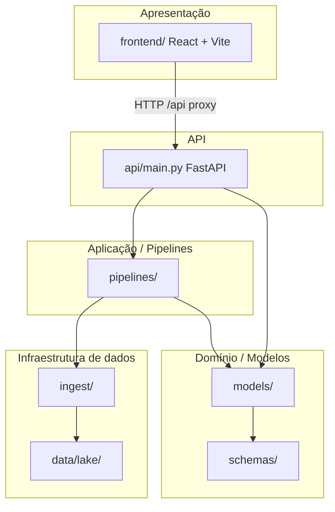

# Arquitetura

## Visão em camadas



## Backend — pacotes Python

| Pacote | Responsabilidade |
|--------|------------------|
| [`ingest/`](../ingest/) | Coleta RSS, persistência bronze, import de fixtures, The Odds API |
| [`pipelines/`](../pipelines/) | Transformações silver/gold, stats WC, KXL, validação, benchmark |
| [`models/`](../models/) | Dixon-Coles, logística, ensemble, baseline, EV, math utils |
| [`schemas/`](../schemas/) | Pydantic: features, national teams, entrada KXL dinâmica |
| [`api/`](../api/) | Rotas REST, CORS, cache de predictor, lifespan warmup |
| [`config.py`](../config.py) | Settings via `.env` (pydantic-settings) |

## Frontend — Clean Architecture

```
frontend/src/
├── domain/           # Entidades, interfaces de repositório (sem deps externas)
├── application/      # Use cases, container DI
├── infrastructure/   # apiFetch, mappers, repositórios concretos
└── presentation/     # Páginas, componentes, tema Tailwind
```

**Princípios SOLID aplicados:**

- **SRP**: use case por operação (`PredictWcMatchUseCase`, `ValidateHistoricalMatchUseCase`)
- **DIP**: páginas dependem de interfaces em `domain/repositories`, não de fetch direto
- **OCP**: novos endpoints → novo repositório/mapper sem alterar domínio

## Datalake local

```
data/lake/
├── bronze/       # RSS bruto (parquet por fonte/data)
├── silver/       # Artigos normalizados + sentimento + times
├── gold/         # Contexto por confronto
├── fixtures/     # world_cup_*.parquet, brasileirao
└── reports/      # Benchmarks, estudos
```

## Dados estáticos (`data/`)

| Caminho | Uso |
|---------|-----|
| `data/sources.yaml` | Fontes RSS |
| `data/rounds/wc_2026.json` | Rodada WC planejada |
| `data/rounds/current.json` | Rodada Brasileirão atual |
| `data/wc/team_baselines.json` | DNA tático KXL (48 seleções) |
| `data/wc/kxl_match_example.json` | Exemplo entrada dinâmica KXL |

## Ciclo de vida da API

1. **Startup** (`lifespan`): treina `WcPredictor` em thread pool (primeira request não trava)
2. **Request**: rotas WC usam `@lru_cache` em `_get_wc_predictor()`
3. **Reload dev**: `scripts/dev-api.sh` exclui `data/*` do watch para não reiniciar na coleta RSS

## Integrações externas

| Serviço | Uso |
|---------|-----|
| [openfootball/worldcup](https://github.com/openfootball/worldcup) | Fixtures Copa 1930–2022 |
| [openfootball/south-america](https://github.com/openfootball/south-america) | Brasileirão |
| [The Odds API](https://the-odds-api.com/) | Odds h2h ao vivo (`ODDS_API_KEY`) |
| Portais RSS | Globo, ESPN, UOL, Fogaonet, Gazeta |

## Deploy

- **Docker**: `Dockerfile` na raiz (Hugging Face Spaces metadata no README)
- **Dev**: uvicorn + Vite proxy
- **Produção frontend**: `npm run build` → servir `frontend/dist` ou CDN
