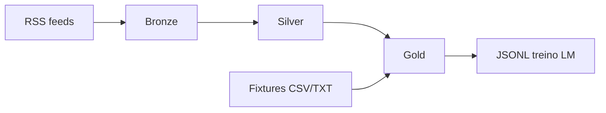
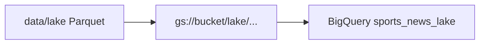

# Datalake e pipelines

## Camadas do datalake



| Camada | Path | Conteúdo |
|--------|------|----------|
| **Bronze** | `data/lake/bronze/` | Feed RSS bruto, metadados, parquet por fonte/data |
| **Silver** | `data/lake/silver/` | Artigos limpos, times, sentimento, menções lesão |
| **Gold** | `data/lake/gold/` | Contexto agregado por confronto + labels |
| **Fixtures** | `data/lake/fixtures/` | `world_cup_YYYY.parquet`, brasileirao |

---

## Fontes RSS

Configuração: [`data/sources.yaml`](../data/sources.yaml)

```yaml
sources:
  - id: globo_esporte
    name: Globo Esporte
    url: https://...
```

| ID | Portal |
|----|--------|
| `globo_esporte` | Globo Esporte |
| `espn_br` | ESPN Brasil |
| `uol_esporte` | UOL Esporte |
| `fogaonet` | Fogaonet |
| `gazeta_esportiva` | Gazeta Esportiva |

```bash
collect-news --list-sources

Por padrão, até **~1000 artigos únicos** por sync (14 fontes RSS + feeds Google Notícias; limite `RSS_MAX_ENTRIES_PER_SOURCE=160`).
```

---

## Comandos CLI

### Ingestão

| Comando | Descrição |
|---------|-----------|
| `collect-news` | RSS → bronze |
| `daily-sync` | Coleta + pipeline silver |
| `import-brasileirao` | Fixtures Brasileirão (openfootball) |
| `import-world-cup` | Fixtures Copa 1930–2022 |

**Copa do Mundo:**

```bash
import-world-cup --list
import-world-cup --missing-only
import-world-cup --seasons 1970 1982 2022
import-world-cup --force
```

### Transformação

| Comando | Descrição |
|---------|-----------|
| `run-pipeline silver` | bronze → silver |
| `run-pipeline gold --season 2024` | silver + fixtures → gold |
| `run-pipeline export` | exporta JSONL para treino LM |

### Previsão

| Comando | Descrição |
|---------|-----------|
| `predict-round` | Rodada `data/rounds/current.json` |
| `predict-wc` | Palpites WC (`--json`, `--home`, `--away`) |
| `study-wc-model` | Relatório JSON do ensemble |

### Odds e valor

| Comando | Descrição |
|---------|-----------|
| `fetch-wc-odds` | Odds ao vivo → `wc_2026_odds.json` |
| `value-wc-odds` | EV positivo vs modelo |

### Benchmark

```bash
benchmark-wc-models --eval-season 2022
benchmark-wc-models --eval-season 2022 --mlflow
```

---

## Arquivos de rodada

### `data/rounds/wc_2026.json`

```json
{
  "season": 2026,
  "competition": "Copa do Mundo",
  "phase": "group",
  "round": 1,
  "matches": [
    { "home_team": "Brasil", "away_team": "Marrocos", "phase": "group", "group": "G" }
  ]
}
```

### `data/rounds/current.json`

Rodada ativa do Brasileirão para `predict-round` e `GET /round/predict`.

---

## Pipeline gold (contexto por jogo)

[`pipelines/gold.py`](../pipelines/gold.py) agrega:

- Artigos silver dos times
- Posição, forma, H2H (fixtures Brasileirão)
- Features para baseline e futura LM

Modo live (`live_mode=True` na API): usa notícias recentes sem label.

---

## Validação histórica WC

[`pipelines/wc_validate.py`](../pipelines/wc_validate.py)

- Lista edições e jogos
- `validate_historical_match`: `before_date = match_date`, filtro estrito `<`
- Sanitiza `NaN` em `group_name` (mata-mata)

---

## Agendamento

- Cron local: [`scripts/cron_collect.sh`](../scripts/cron_collect.sh)
- GitHub Actions: [`.github/workflows/daily-collect.yml`](../.github/workflows/daily-collect.yml)

---

## Export para treino LM

```python
from models.dataset import export_jsonl
export_jsonl("data/training/bolao_train.jsonl")
```

Formato JSONL: contexto textual + label `1`/`X`/`2`.

Treino:

```bash
pip install -e ".[ml]"
python -m models.train
```

Integração recomendada: [Unsloth](https://github.com/unslothai/unsloth).

---

## Storage: Parquet local + DuckDB + BigQuery

### Camada local (padrão)

| Dado | Path | Formato |
|------|------|---------|
| Notícias | `data/lake/bronze`, `silver`, `gold` | Parquet particionado |
| Fixtures | `data/lake/fixtures/` | Parquet |
| Stats Sofascore | `data/lake/sofascore/match_stats.parquet` | Parquet único |
| Auditoria Sofascore | `data/lake/sofascore/*_stats.json` | JSON por jogo (opcional) |

Cada ingestão Sofascore grava JSON + upsert no parquet. Para reconstruir o parquet a partir dos JSONs:

```bash
ingest-sofascore --compact-parquet
ingest-sofascore --compact-parquet --json
```

### Consultas SQL locais (DuckDB)

```bash
pip install -e ".[analytics]"
lake-query --preset summary
lake-query --preset team-xg --team Brasil --limit 10
lake-query --sql "SELECT home_team, AVG(home_xg) AS avg_xg FROM sofascore GROUP BY 1 ORDER BY 2 DESC LIMIT 5"
```

Views disponíveis: `bronze`, `silver`, `gold`, `fixtures` / `silver_fixtures`, `sofascore` / `silver_sofascore`.

### Quando ativar BigQuery + GCS

| Gatilho | Ação |
|---------|------|
| Lake > ~500 MB ou histórico longo de notícias | `sync-gcp --layer all` |
| Múltiplos ambientes (dev/staging/prod) | Sync periódico para GCS |
| Dashboards / SQL ad hoc na nuvem | BigQuery como camada analítica |
| Sofascore no BQ para joins com fixtures | `sync-gcp --layer silver_sofascore` |

```bash
pip install -e ".[gcp]"
# .env: GCP_PROJECT, BQ_DATASET, GCS_BUCKET (opcional)
sync-gcp --list-layers
sync-gcp --layer all --truncate
sync-gcp --layer silver_sofascore --truncate
sync-gcp --layer bronze_sofascore --truncate
sync-gcp --layer gold_wc --truncate
```

Tabelas BigQuery (medalhão em `sports_news_lake`):

| Camada | Tabela BQ |
|--------|-----------|
| Bronze notícias | `bronze_articles` |
| Bronze Sofascore | `bronze_sofascore_events` |
| Silver notícias | `silver_articles` |
| Silver Sofascore | `silver_sofascore_match_stats` |
| Silver fixtures WC | `silver_fixtures_results` |
| Gold bolão | `gold_bolao_context` |
| Gold WC features | `gold_wc_match_features` |

Tabelas legadas (`sofascore_match_stats`, `fixtures_results`) podem ser removidas manualmente no console BQ após migração.

**Não substitua** o Parquet local — a API e os modelos ML continuam lendo arquivos no volume (`LAKE_ROOT`). O BigQuery é camada analítica/backup, não storage primário de runtime.

### GCS (camada de objetos — padrão GCP)

No desenho correto, o fluxo é **Parquet local → GCS → BigQuery**:



Layout medalhão no bucket (quando `GCS_BUCKET` está definido):

```
gs://{GCS_BUCKET}/
└── lake/
    ├── bronze/articles/...
    ├── bronze/sofascore/events.parquet
    ├── silver/articles/...
    ├── silver/sofascore/match_stats.parquet
    ├── silver/fixtures/world_cup_fixtures.parquet
    ├── gold/bolao/...
    └── gold/wc/match_features.parquet
```

**Configuração no GCP** (service account `modelo-cp@beanalytic-dev.iam.gserviceaccount.com`):

1. Criar bucket, ex.: `beanalytic-dev-sports-news-lake` (região `US`, mesma do BQ)
2. IAM no bucket: `Storage Object Admin` (ou `Storage Admin`)
3. `.env`: `GCS_BUCKET=beanalytic-dev-sports-news-lake`
4. `sync-gcp --layer all --truncate` — sobe Parquet ao GCS e carrega no BQ a partir de `gs://`

Sem `GCS_BUCKET`, o `sync-gcp` usa **fallback direto** (Parquet local → BQ), útil em dev quando a SA ainda não tem permissão no Storage.

## Escalabilidade GCP (opcional)

```bash
pip install -e ".[gcp]"
```

Variáveis: `GCP_PROJECT`, `BQ_DATASET`, `GCS_BUCKET` — ver `.env.example`.
