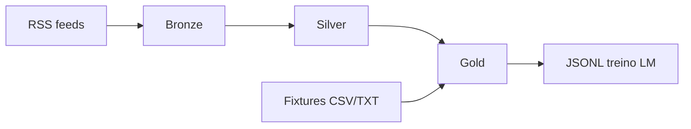

# Datalake e pipelines

## Camadas do datalake



| Camada | Path | Conteúdo |
|--------|------|----------|
| **Bronze** | `data/lake/bronze/` | Feed RSS bruto, metadados, parquet por fonte/data |
| **Silver** | `data/lake/silver/` | Artigos limpos, times, sentimento, menções lesão |
| **Gold** | `data/lake/gold/` | Contexto agregado por confronto + labels |
| **Fixtures** | `data/lake/fixtures/` | `world_cup_YYYY.parquet`, brasileirao |

---

## Fontes RSS

Configuração: [`data/sources.yaml`](../data/sources.yaml)

```yaml
sources:
  - id: globo_esporte
    name: Globo Esporte
    url: https://...
```

| ID | Portal |
|----|--------|
| `globo_esporte` | Globo Esporte |
| `espn_br` | ESPN Brasil |
| `uol_esporte` | UOL Esporte |
| `fogaonet` | Fogaonet |
| `gazeta_esportiva` | Gazeta Esportiva |

```bash
collect-news --list-sources
```

---

## Comandos CLI

### Ingestão

| Comando | Descrição |
|---------|-----------|
| `collect-news` | RSS → bronze |
| `daily-sync` | Coleta + pipeline silver |
| `import-brasileirao` | Fixtures Brasileirão (openfootball) |
| `import-world-cup` | Fixtures Copa 1930–2022 |

**Copa do Mundo:**

```bash
import-world-cup --list
import-world-cup --missing-only
import-world-cup --seasons 1970 1982 2022
import-world-cup --force
```

### Transformação

| Comando | Descrição |
|---------|-----------|
| `run-pipeline silver` | bronze → silver |
| `run-pipeline gold --season 2024` | silver + fixtures → gold |
| `run-pipeline export` | exporta JSONL para treino LM |

### Previsão

| Comando | Descrição |
|---------|-----------|
| `predict-round` | Rodada `data/rounds/current.json` |
| `predict-wc` | Palpites WC (`--json`, `--home`, `--away`) |
| `study-wc-model` | Relatório JSON do ensemble |

### Odds e valor

| Comando | Descrição |
|---------|-----------|
| `fetch-wc-odds` | Odds ao vivo → `wc_2026_odds.json` |
| `value-wc-odds` | EV positivo vs modelo |

### Benchmark

```bash
benchmark-wc-models --eval-season 2022
benchmark-wc-models --eval-season 2022 --mlflow
```

---

## Arquivos de rodada

### `data/rounds/wc_2026.json`

```json
{
  "season": 2026,
  "competition": "Copa do Mundo",
  "phase": "group",
  "round": 1,
  "matches": [
    { "home_team": "Brasil", "away_team": "Marrocos", "phase": "group", "group": "G" }
  ]
}
```

### `data/rounds/current.json`

Rodada ativa do Brasileirão para `predict-round` e `GET /round/predict`.

---

## Pipeline gold (contexto por jogo)

[`pipelines/gold.py`](../pipelines/gold.py) agrega:

- Artigos silver dos times
- Posição, forma, H2H (fixtures Brasileirão)
- Features para baseline e futura LM

Modo live (`live_mode=True` na API): usa notícias recentes sem label.

---

## Validação histórica WC

[`pipelines/wc_validate.py`](../pipelines/wc_validate.py)

- Lista edições e jogos
- `validate_historical_match`: `before_date = match_date`, filtro estrito `<`
- Sanitiza `NaN` em `group_name` (mata-mata)

---

## Agendamento

- Cron local: [`scripts/cron_collect.sh`](../scripts/cron_collect.sh)
- GitHub Actions: [`.github/workflows/daily-collect.yml`](../.github/workflows/daily-collect.yml)

---

## Export para treino LM

```python
from models.dataset import export_jsonl
export_jsonl("data/training/bolao_train.jsonl")
```

Formato JSONL: contexto textual + label `1`/`X`/`2`.

Treino:

```bash
pip install -e ".[ml]"
python -m models.train
```

Integração recomendada: [Unsloth](https://github.com/unslothai/unsloth).

---

## Escalabilidade GCP (opcional)

```bash
pip install -e ".[gcp]"
```

Variáveis: `GCP_PROJECT`, `BQ_DATASET`, `GCS_BUCKET` — ver `.env.example`.
