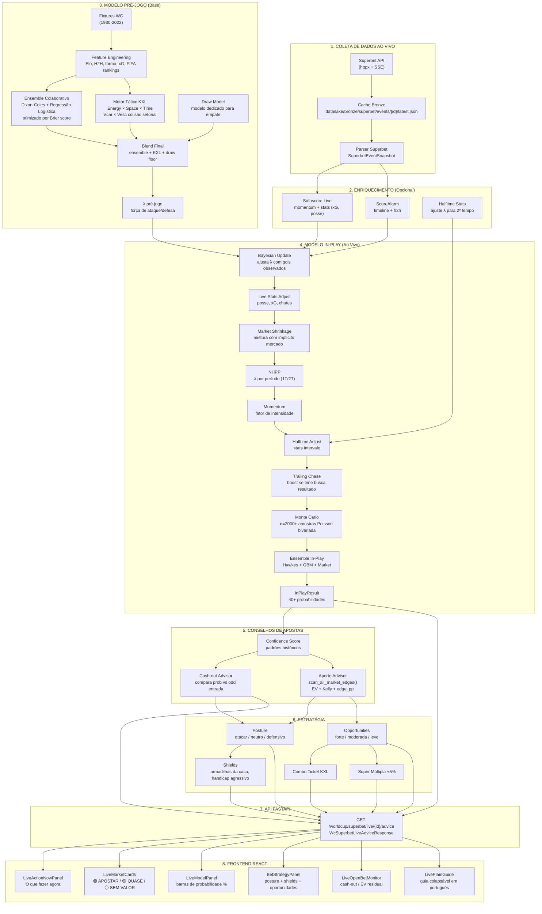
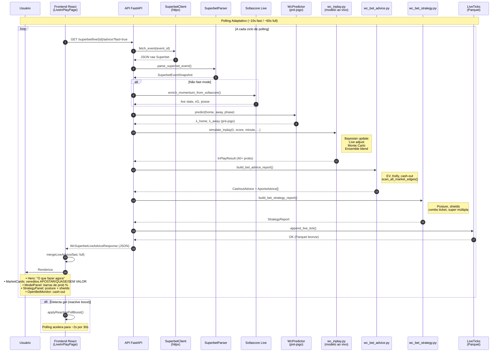
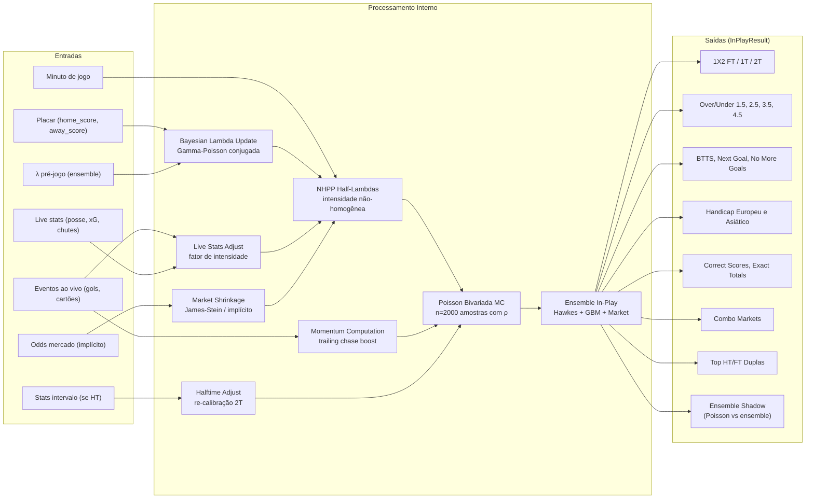
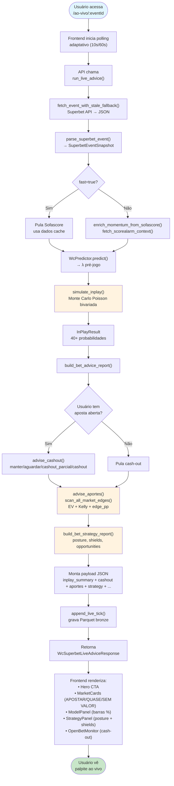
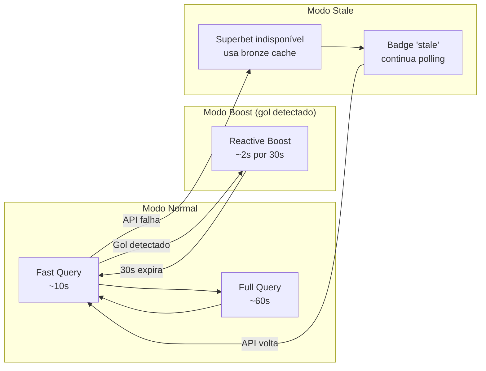

# Diagrama: Como o Modelo Gera Palpites Ao Vivo (In-Play)

> Este diagrama mostra o fluxo completo desde a coleta de dados da Superbet até o palpite final exibido no frontend.

---

## 1. Diagrama de Arquitetura (Visão Geral)



---

## 2. Diagrama de Sequência (Fluxo Temporal)



---

## 3. Diagrama de Componentes do Modelo In-Play



---

## 4. Diagrama de Decisão: Como o Palpite é Gerado



---

## 5. Resumo dos Módulos Principais

| Módulo | Arquivo | Função |
|--------|---------|--------|
| **Coleta** | `ingest/superbet/client.py` | HTTP Superbet (httpx + SSE) |
| **Cache** | `ingest/superbet/store.py` | Fallback bronze JSON + stale |
| **Parser** | `ingest/superbet/parser.py` | Converte raw → SuperbetEventSnapshot |
| **Predictor Pré-Jogo** | `models/wc_predictor.py` | Ensemble + KXL + draw model |
| **Modelo In-Play** | `models/wc_inplay.py` | Poisson MC + Bayesian + momentum |
| **Handicap** | `models/wc_handicap.py` | Probabilidades handicap asiático |
| **Conselhos** | `models/wc_bet_advice.py` | Cash-out + aportes (EV/Kelly) |
| **Estratégia** | `models/wc_bet_strategy.py` | Posture, shields, combo ticket |
| **Orquestração** | `ingest/superbet/advice.py` | Junta tudo em run_live_advice() |
| **API** | `api/main.py` | Endpoints /worldcup/superbet/live/* |
| **Frontend** | `frontend/src/presentation/pages/LiveInPlayPage.tsx` | Página ao vivo com 4 tabs |

---

## 6. Exemplo de Payload de Resposta

```json
{
  "event_id": "13127506",
  "inplay_summary": {
    "prob_final_home": 0.42,
    "prob_final_draw": 0.28,
    "prob_final_away": 0.30,
    "over_25": 0.55,
    "btts": 0.48,
    "prob_next_goal_home": 0.45,
    "prob_no_more_goals": 0.12,
    "lambda_adjustment": "prior → full"
  },
  "cashout": {
    "action": "manter",
    "confidence": 0.72,
    "reason": "EV residual positivo, modelo favorece mesmo resultado"
  },
  "aportes": [
    {
      "market": "h2h",
      "outcome": "home",
      "model_prob": 0.42,
      "market_odd": 2.80,
      "ev": 0.176,
      "edge_pp": 5.2,
      "kelly_fraction": 0.063,
      "stake_suggested": 31.50,
      "classification": "forte"
    }
  ],
  "strategy": {
    "posture": "atacar_com_limite",
    "shields": ["evitar_handicap_agressivo_2t"],
    "opportunities": [
      {"tier": "forte", "market": "h2h_home", "ev": 0.176, "stake": 31.50}
    ],
    "watch_list": ["over_25", "btts_yes"]
  },
  "live_stats": {
    "possession_home": 58,
    "xg_home": 1.2,
    "xg_away": 0.8,
    "shots_home": 8,
    "shots_away": 4
  },
  "superbet_stale": false
}
```

---

## 7. Polling Adaptativo no Frontend


