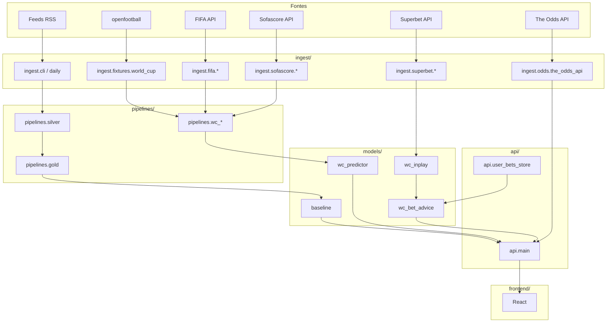
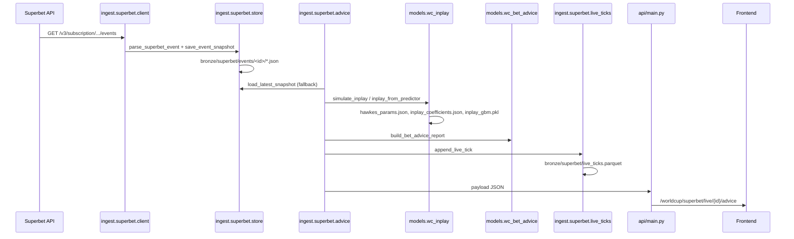

# Fluxo de Dados — api-noticia / Bolão AI

> Mapeamento completo das fontes de dados, caminhos gerados, leitores/escritores,
> dependências e inconsistências encontradas no projeto.
> Data da análise: 2026-06-21.

---

## 1. Resumo executivo

O projeto é uma plataforma de previsões esportivas (bolão 1/X/2) composta por
quatro fluxos principais:

1. **Notícias**: RSS → bronze → silver → gold → treino LM / API.
2. **Copa do Mundo**: fixtures históricos + FIFA/Sofascore → features → modelo
   `WcPredictor` (pickle) → API REST.
3. **Ao vivo Superbet**: API de oferta → snapshot bronze → modelo in-play
   (Poisson/MC/ensemble) → advice (aportes/cash-out) → API/frontend.
4. **Amistosos/Simulate**: Sofascore + FIFA → friendlies → simulador → API.

A arquitetura pretendida é `ingest → pipelines → models → api → frontend`, mas
o código real apresenta várias quebras de camada, dependências circulares e
leituras/escritas espalhadas por múltiplos módulos.

---

## 2. Fontes de dados externas

| Fonte | Tecnologia | Módulo principal | Uso | Autenticação |
|-------|------------|------------------|-----|--------------|
| Feeds RSS (`data/sources.yaml`) | `feedparser.parse` + `httpx.AsyncClient` | `ingest/sources.py` | Coleta de notícias esportivas | Não |
| openfootball/worldcup | `httpx.AsyncClient` (raw GitHub) | `ingest/fixtures/worldcup.py` | Fixtures Copa 1930–2022 | Não |
| openfootball/south-america | `httpx.AsyncClient` | `ingest/fixtures/brasileirao.py` | Brasileirão / Copa do Brasil | Não |
| API FIFA (`api.fifa.com` / `inside.fifa.com`) | `httpx.Client` | `ingest/fifa/client.py` | Rankings, janela de jogos, detalhes de partida | Não |
| Sofascore | `curl_cffi.requests` | `ingest/sofascore/client.py` | xG, stats, escalações (FEPT), eventos, amistosos | Não |
| Superbet BR oferta | `httpx.Client` + SSE | `ingest/superbet/client.py` | Odds ao vivo, snapshots de eventos | Não |
| Scorealarm (Superbet) | `httpx.Client` | `ingest/superbet/scorealarm/client.py` | Stats ao vivo alternativos | Não |
| Social Top Picks (Superbet) | `httpx.Client` | `ingest/superbet/scorealarm/social.py` | Picks sociais | Não |
| The Odds API | `httpx.Client` | `ingest/odds/the_odds_api.py` | Odds pré-jogo / ao vivo para value bets | `ODDS_API_KEY` |
| API-Football | `httpx.AsyncClient` | `ingest/stats/api_football.py` | Enriquecimento gold (opcional) | `API_FOOTBALL_KEY` |
| Perplexity / Moonshot / Gemini | `httpx.post` | `ingest/research/*.py` | Deep research pré-jogo (opcional) | Chaves específicas |

### Observações sobre fontes

- O `data/sources.yaml` possui **15 fontes** (14 ativas + `lance` desativada),
  enquanto a documentação (`README.md`) lista apenas **5 fontes ativas**.
- A coleta de corpo completo (`fetch_body=true`) faz um segundo `httpx.get` por
  artigo, respeitando `robots.txt` de forma manual via `User-Agent`.

---

## 3. Arquivos e diretórios gerados

### 3.1 Diretórios raiz configuráveis (`config.py`)

| Variável | Default | Conteúdo |
|----------|---------|----------|
| `LAKE_ROOT` | `./data/lake` | Raiz de todo o datalake local |
| `SOURCES_YAML` | `./data/sources.yaml` | Configuração RSS |
| `SOFASCORE_FEPT_DIR` | `data/lake/fept` | Escalações FEPT por evento (JSON) |
| `SOFASCORE_STATS_DIR` | `data/lake/sofascore` | Stats xG consolidados (parquet) |
| `SOFASCORE_ENRICH_DIR` | `data/lake/sofascore/enrich` | Enriquecimento Sofascore (parquet) |
| `FIFA_MATCHES_DIR` | `data/lake/fifa/matches` | Detalhes de jogos FIFA (JSON) |
| `FIFA_RANKINGS_CACHE_PATH` | `data/lake/fifa/rankings_live.json` | Cache de rankings FIFA |
| `FIFA_WINDOW_CACHE_PATH` | `data/lake/fifa/window_matches.json` | Cache da janela FIFA |
| `WC_SQUADS_PATH` | `data/wc/squads_2026.json` | Convocações estáticas |
| `WC_ARTIFACT_DIR` | `data/lake/artifacts/wc_predictor` | Pickle + manifest do predictor |
| `SUPERBET_ODDS_PATH` | `data/rounds/superbet_odds.json` | Odds pré-jogo Superbet |
| `WALLET_INBOX_DIR` | `inbox/wallet` | CSVs de extrato (sob `LAKE_ROOT`) |

### 3.2 Medalhão de notícias

| Caminho | Formato | Quem escreve | Quem lê |
|---------|---------|--------------|---------|
| `data/lake/bronze/source=<id>/year=YYYY/month=MM/day=DD/articles_HHMMSS.parquet` | Parquet particionado | `ingest.storage.save_bronze` | `ingest.storage.load_bronze`, `pipelines.silver` |
| `data/lake/silver/year=YYYY/month=MM/day=DD/articles_HHMMSS.parquet` | Parquet | `pipelines.silver.save_silver` | `pipelines.gold`, `pipelines.news_feed`, `api/main.py` |
| `data/lake/gold/year=YYYY/month=MM/context_HHMMSS.parquet` | Parquet | `pipelines.gold.save_gold` | `models.dataset.load_gold_dataset`, `models.train` |
| `data/training/bolao_train.jsonl` | JSONL | `models.dataset.export_jsonl` | Treinamento LM (`models.train`) |
| `data/lake/_meta/collections.jsonl` | JSONL append-only | `ingest.meta.log_collection` | `ingest.meta.collection_stats`, `api/data_pulse.py` |

### 3.3 Fixtures / Copa do Mundo

| Caminho | Formato | Quem escreve | Quem lê |
|---------|---------|--------------|---------|
| `data/lake/fixtures/world_cup_<season>.parquet` | Parquet | `ingest.fixtures.world_cup.save_wc_fixtures` | `models.wc_artifact`, `pipelines.wc_stats`, `models.wc_predictor` |
| `data/lake/fixtures/brasileirao_<season>.parquet` | Parquet | `ingest.fixtures.store.save_fixtures_df` | `ingest.fixtures.store.load_fixtures`, `pipelines.gold`, `models.baseline` |
| `data/lake/fixtures/copa_brasil_<season>.parquet` | Parquet | `ingest.fixtures.store.save_fixtures_df` | `ingest.fixtures.store.load_fixtures` |
| `data/lake/fixtures/fifa_matches.parquet` | Parquet | `ingest.fifa.fixtures_importer` | `ingest.fixtures.world_cup.load_wc_fixtures` |
| `data/lake/fixtures/sofascore_matches.parquet` | Parquet | `ingest.sofascore.fixtures_importer` | `ingest.fixtures.world_cup.load_wc_fixtures` |
| `data/lake/artifacts/wc_predictor/predictor.pkl` | Pickle | `models.wc_artifact.save_artifact` | `models.wc_artifact.load_artifact` |
| `data/lake/artifacts/wc_predictor/manifest.json` | JSON | `models.wc_artifact.save_artifact` | `models.wc_artifact.load_artifact` |
| `data/lake/artifacts/wc_predictor/train_progress.json` | JSON | `models.wc_train_progress` | `models.wc_train_progress` |
| `data/lake/artifacts/wc_predictor/logistic_features_cache.json` | JSON | `models.wc_feature_cache` | `models.logistic_wc` |
| `data/lake/gold/wc/copa_labels*.parquet` | Parquet | `pipelines.wc_training_dataset.export_wc_copa_labels_dataset` | Treino / debug |
| `data/lake/silver/wc_timeline/timeline.parquet` | Parquet | `pipelines.wc_build_timeline` | `pipelines.wc_inplay_tune` |

### 3.4 Sofascore

| Caminho | Formato | Quem escreve | Quem lê |
|---------|---------|--------------|---------|
| `data/lake/sofascore/match_stats.parquet` | Parquet | `ingest.sofascore.stats_dataset`, `ingest.sofascore.compact_stats` | `pipelines.wc_sofascore_features`, `models.corners_predictor`, `pipelines.lake_query` |
| `data/lake/sofascore/enrich/*.parquet` | Parquet | `ingest.sofascore.enrich_dataset` | `models.wc_match_simulator` |
| `data/lake/sofascore/live/<event_id>/latest.json` | JSON | `ingest.sofascore.live_momentum` | `pipelines.inplay_match_states` |
| `data/lake/fept/<event_id>.json` | JSON | `ingest.sofascore.fept_ingest` | `ingest.sofascore.kxl_sofascore_ingest`, `models.wc_match_simulator` |
| `data/lake/fifa/matches/<id_match>.json` | JSON | `ingest.fifa.match_ingest` | `models.wc_match_simulator` |
| `data/lake/fifa/rankings_live.json` | JSON | `ingest.fifa.rankings_live` | `pipelines.wc_fifa_rankings`, `models.wc_match_simulator` |
| `data/lake/fifa/window_matches.json` | JSON | `ingest.fifa.match_ingest` | `ingest.fifa.friendlies`, `models.wc_match_simulator` |
| `data/lake/friendlies/<year>.json` | JSON | `ingest.sofascore.friendlies.save_friendlies_snapshot` | `api/main.py` (`GET /worldcup/friendlies`) |

### 3.5 Superbet ao vivo

| Caminho | Formato | Quem escreve | Quem lê |
|---------|---------|--------------|---------|
| `data/lake/bronze/superbet/events/<event_id>/<ts>.json` | JSON | `ingest.superbet.store.save_event_snapshot` | `ingest.superbet.store.load_latest_snapshot`, `pipelines.inplay_event_finals` |
| `data/lake/bronze/superbet/events/<event_id>/latest.json` | JSON | `ingest.superbet.store.save_event_snapshot` | `ingest.superbet.store.load_latest_snapshot`, `ingest.superbet.advice`, `models.bet_guardrails` |
| `data/lake/bronze/superbet/live_ticks.parquet` | Parquet append-only | `ingest.superbet.live_ticks.append_live_tick` | `pipelines.inplay_benchmark`, `pipelines.wc_full_improvement`, `models.wc_trend_advisor` |
| `data/lake/bronze/superbet/scorealarm/<event_id>/` | JSON | `ingest.superbet.scorealarm.store` | `ingest.superbet.scorealarm.service` |
| `data/lake/bronze/superbet/halftime/` | JSON/Parquet | `ingest.superbet.halftime_snapshot` | `models` |
| `data/lake/gold/superbet/events/<event_id>/` | JSON/Parquet | `ingest.superbet.event_finalize` | Retreino / postmortem |
| `data/lake/live_contexts/<event_id>.json` | JSON | `ingest.superbet.match_context_store` | `ingest.superbet.advice` |
| `data/rounds/superbet_odds.json` | JSON | `ingest.superbet.store.merge_snapshot_into_odds_file` | `pipelines.wc_market_features` |
| `data/lake/artifacts/superbet_finalized_events.json` | JSON | `ingest.superbet.event_finalize`, `api/main.py` | `api/main.py`, `pipelines.wc_full_improvement` |
| `data/lake/artifacts/inplay_coefficients.json` | JSON | `models.wc_inplay_coefficients` | `models.wc_inplay` |
| `data/lake/artifacts/hawkes_params.json` | JSON | `pipelines.wc_inplay_hawkes_fit` | `models.wc_inplay` |
| `data/lake/artifacts/inplay_gbm.pkl` | Pickle | `models.wc_inplay_gbm` | `models.wc_inplay` |
| `data/lake/artifacts/inplay_gbm_feedback_v*.json/pkl` | JSON/Pickle | `pipelines.feedback_retrain` | `models.wc_inplay_gbm` |
| `data/lake/silver/inplay/match_states.parquet` | Parquet | `pipelines.inplay_match_states` | `pipelines.inplay_synthetic_feedback`, `pipelines.inplay_postmortem` |
| `data/lake/silver/bet_reconciliation/` | Parquet | `pipelines.user_bet_reconciliation` | `pipelines.wc_full_improvement` |

### 3.6 Usuário / Carteira

| Caminho | Formato | Quem escreve | Quem lê |
|---------|---------|--------------|---------|
| `data/lake/user_open_bets.json` | JSON | `api.user_bets_store` | `api.user_bets_store`, `models.wc_bet_advice`, `models.wc_hedge_advisor` |
| `data/lake/user_settled_bets.json` | JSON | `api.user_bets_store` | `api.user_bets_store`, `pipelines.user_bet_analytics` |
| `data/lake/bronze/user_transactions/user=<id>/...parquet` | Parquet | `ingest.user_transactions.store` | `pipelines.user_bet_reconciliation` |
| `data/lake/inbox/wallet/<user_id>/` | CSV (inbox) | `ingest.user_transactions.wallet_inbox` | `api/main.py` (`POST /user/wallet/import-inbox`) |

### 3.7 Relatórios / cache

| Caminho | Formato | Quem escreve | Quem lê |
|---------|---------|--------------|---------|
| `data/lake/reports/wc_benchmark_report.json` | JSON | `pipelines.wc_benchmark`, `pipelines.model_benchmark_history` | `pipelines.mlflow_registry` |
| `data/lake/reports/wc_walkforward_report.json` | JSON | `pipelines.wc_walkforward`, `pipelines.model_benchmark_history` | `pipelines.mlflow_registry` |
| `data/lake/reports/inplay_benchmark_report.json` | JSON | `pipelines.model_benchmark_history` | `api/main.py` |
| `data/lake/reports/model_benchmark_history.json` | JSON | `pipelines.model_benchmark_history` | `pipelines.model_benchmark_history` |
| `data/lake/reports/model_benchmark_latest.json` | JSON | `pipelines.model_benchmark_history` | `pipelines.mlflow_registry` |
| `data/lake/reports/wc_2026_predictions.json` | JSON | `pipelines.wc_schedule` | `api/main.py`, `pipelines.weekly_pl_report` |
| `data/lake/reports/wc_2026_predictions_latest.json` | JSON | `pipelines.wc_schedule` | `api/main.py`, `pipelines.weekly_pl_report` |
| `data/lake/cache/wc_round_predictions.json` | JSON | `api.wc_round_cache` | `api.wc_round_cache` |
| `data/lake/logs/` | TXT/JSON | `pipelines.wallet_reminder` | Debug |
| `data/lake/pregame_research/` | JSON | `ingest.research.research_cache` | `ingest.research.*_synthesizer` |

---

## 4. Mapeamento detalhado: quem lê e quem escreve

### 4.1 Notícias

```mermaid
flowchart LR
    RSS[Fontes RSS] -->|collect_all_sources| BRONZE[data/lake/bronze]
    BRONZE -->|bronze_to_silver| SILVER[data/lake/silver]
    SILVER -->|build_gold_for_match| GOLD[data/lake/gold]
    GOLD -->|export_jsonl| JSONL[data/training/bolao_train.jsonl]
    JSONL -->|train| LM[models/bolao_predictor]
    LM --> API[/predict /context]
```

| Módulo | Escreve | Lê |
|--------|---------|----|
| `ingest.sources` | — | RSS via `httpx` + `feedparser` |
| `ingest.cli` | Chama `save_bronze` | — |
| `ingest.storage` | `data/lake/bronze/...` | `data/lake/bronze/...` |
| `ingest.news_sync` | Orquestra bronze + silver | — |
| `ingest.daily` | Orquestra `sync_news_sources` | — |
| `pipelines.silver` | `data/lake/silver/...` | `data/lake/bronze/...` |
| `pipelines.gold` | `data/lake/gold/...` | `data/lake/silver/...`, `data/lake/fixtures/...` |
| `models.dataset` | `data/training/bolao_train.jsonl` | `data/lake/gold/...` |
| `models.bolao_predictor` | `models/checkpoints/...` (via `transformers`) | `data/training/bolao_train.jsonl` |
| `api/main.py` | — | `data/lake/silver/...` (news feed/cards) |

### 4.2 Copa do Mundo

```mermaid
flowchart LR
    OPEN[openfootball] -->|fetch_edition| FIX[data/lake/fixtures/world_cup_*.parquet]
    FIFA_API[FIFA API] -->|match_ingest| FIFA_FIX[data/lake/fixtures/fifa_matches.parquet]
    SOFA_API[Sofascore API] -->|fixtures_importer| SOFA_FIX[data/lake/fixtures/sofascore_matches.parquet]
    FIX -->|build_match_features| FEAT[pipelines.wc_stats]
    FEAT -->|train_wc_predictor| ARTIFACT[data/lake/artifacts/wc_predictor/predictor.pkl]
    ARTIFACT -->|load_artifact| API[/worldcup/predict]
```

| Módulo | Escreve | Lê |
|--------|---------|----|
| `ingest.fixtures.world_cup` | `data/lake/fixtures/world_cup_*.parquet` | openfootball via `httpx` |
| `ingest.fifa.fixtures_importer` | `data/lake/fixtures/fifa_matches.parquet` | FIFA API |
| `ingest.sofascore.fixtures_importer` | `data/lake/fixtures/sofascore_matches.parquet` | Sofascore API |
| `pipelines.wc_stats` | — (features em memória) | `data/lake/fixtures/...`, rankings, squads |
| `pipelines.wc_training_dataset` | `data/lake/gold/wc/copa_labels_*.parquet` | `data/lake/fixtures/...` |
| `models.wc_artifact` | `predictor.pkl`, `manifest.json` | `data/lake/fixtures/...`, `data/wc/...` |
| `models.wc_predictor` | — | Fixtures em memória |
| `api/main.py` | — | `predictor.pkl` (via `load_or_train_wc_predictor`) |

### 4.3 Ao vivo Superbet

```mermaid
flowchart LR
    SB[Superbet API] -->|fetch_event| STORE[ingest.superbet.store]
    STORE -->|save_event_snapshot| BRONZE[data/lake/bronze/superbet/events/<id>/]
    BRONZE -->|load_latest_snapshot| ADVICE[ingest.superbet.advice]
    ADVICE -->|run_live_advice| MODEL[models.wc_inplay]
    MODEL -->|build_bet_advice_report| ADVICE2[models.wc_bet_advice]
    ADVICE2 --> TICKS[data/lake/bronze/superbet/live_ticks.parquet]
    ADVICE2 --> API[/worldcup/superbet/live/{id}/advice]
```

| Módulo | Escreve | Lê |
|--------|---------|----|
| `ingest.superbet.client` | — | Superbet API via `httpx` |
| `ingest.superbet.store` | `data/lake/bronze/superbet/events/<id>/*.json` | `data/lake/bronze/superbet/events/<id>/latest.json` |
| `ingest.superbet.live_ticks` | `data/lake/bronze/superbet/live_ticks.parquet` | O próprio parquet |
| `ingest.superbet.advice` | Registra ticks, pulso | Snapshots, `live_contexts`, ticks |
| `models.wc_inplay` | — | `inplay_coefficients.json`, `hawkes_params.json`, `inplay_gbm.pkl` |
| `models.wc_bet_advice` | — | Odds do snapshot, probs do modelo |
| `pipelines.poll_superbet_live` | Orquestra escrita em bronze/ticks | `data/rounds/wc_2026.json` |
| `api/main.py` | — | Advice em memória/cache |

### 4.4 Amistosos / Simulate

```mermaid
flowchart LR
    SOFA_API[Sofascore API] -->|list_team_friendlies| FRIEND[data/lake/friendlies/<year>.json]
    FIFA_API[FIFA API] -->|list_fifa_team_friendlies| FRIEND
    FRIEND -->|worldcup/friendlies| API
    SIM[POST /worldcup/simulate] -->|simulate_match| SIM_RES[WcSimulationResponse]
    SIM_RES --> API2[/worldcup/simulate]
```

| Módulo | Escreve | Lê |
|--------|---------|----|
| `ingest.sofascore.friendlies` | `data/lake/friendlies/<year>.json` | Sofascore API |
| `ingest.fifa.friendlies` | — (apenas merge) | FIFA window cache |
| `models.wc_match_simulator` | — | FIFA details, Sofascore enrich/stats/FEPT |
| `api/main.py` | — | Amistosos e resultado da simulação |

---

## 5. Dependências entre camadas

A arquitetura documentada é:

```
ingest → pipelines → models → api → frontend
```

A arquitetura real, analisada via AST de imports, é:

```text
api     → config, ingest, models, pipelines, schemas
ingest  → api, config, models, pipelines, schemas
models  → api, config, ingest, pipelines, schemas
pipelines → config, ingest, models, schemas
schemas → config
```

### Quebras de camada significativas

| Quebra | Import real | Impacto |
|--------|-------------|---------|
| `ingest → api` | `ingest.superbet.advice` importa `api.user_bets_store` | Ingestão depende da API para ler apostas abertas |
| `ingest → models` | `ingest.superbet.advice` importa `models.wc_*` | Ingestão executa modelos diretamente |
| `models → api` | `models.wc_match_simulator` e outros não importam api, mas `models.wc_bet_advice` lê `data/lake/user_open_bets.json` (escrito por `api`) | Acoplamento via filesystem |
| `models → ingest` | `models.wc_artifact` importa `ingest.fixtures.world_cup` | Modelos leem fixtures diretamente |
| `pipelines → ingest` | Esperado, mas `pipelines.silver` importa `ingest.gcp.lake_frames` que importa `models.dataset` e `pipelines.silver` → ciclo | Ver seção 7 |
| `api → ingest` | `api/main.py` importa ~15 módulos de `ingest` | AGENTS.md proíbe import direto de `ingest` pela API |

---

## 6. Dependências circulares detectadas

Foram detectados **16 ciclos diretos** entre módulos e **2 ciclos entre pacotes**.

### 6.1 Ciclos entre pacotes

```
ingest ↔ api
models ↔ pipelines
```

### 6.2 Ciclos diretos entre módulos

| Ciclo | Módulos envolvidos | Risco |
|-------|--------------------|-------|
| `ingest.storage ↔ ingest.gcp.lake_frames` | `storage.save_bronze` importa `lake_frames`; `lake_frames` usa `models.dataset` e `pipelines.silver` que usam `storage` | Import indireto pode causar `ImportError` em reloads |
| `ingest.sofascore.fept_ingest ↔ ingest.sofascore.kxl_sofascore_ingest` | FEPT e KXL se referenciam mutuamente | Dificulta testes unitários isolados |
| `ingest.sofascore.friendlies ↔ ingest.fifa.friendlies` | Sofascore importa FIFA friendlies; FIFA friendlies importa `FriendlyMatch` de Sofascore | Acoplamento de domínio |
| `pipelines.wc_baselines ↔ pipelines.wc_kxl_collision` | Baselines e colisão KXL se referenciam | Refatoração difícil |
| `pipelines.wc_training_dataset ↔ pipelines.wc_holdout` | Dataset de treino e holdout se importam | Lógica de split duplicada/espalhada |
| `models.wc_team_patterns ↔ models.wc_combo_last10` | Padrões de time e combo last10 se referenciam | Dificilmente testável isoladamente |
| `models.dataset ↔ ingest.gcp.lake_frames` | Dataset lê gold; `lake_frames` normaliza dataset | Ciclo entre models e ingest |
| `pipelines.silver ↔ ingest.gcp.lake_frames` | Silver normaliza via lake_frames; lake_frames depende de silver | Camada ingest misturada com pipelines |

### 6.3 Ciclos indiretos relevantes

- `api.main → ingest.superbet.advice → api.user_bets_store → api.main`
  (via leitura de apostas abertas no advice).
- `models.wc_artifact → ingest.fixtures.world_cup → ingest.gcp.lake_store →
  ingest.gcp.sync → ingest.gcp.lake_frames → models.dataset` (cadeia longa de
  dependência entre models e ingest).

---

## 7. Duplicações de lógica / dados

### 7.1 Duplicação de lógica

| Lógica | Onde aparece | Problema |
|--------|--------------|----------|
| Extração de times de texto | `pipelines.silver._extract_entities`, `schemas.teams.BRAZILIAN_TEAMS`, `pipelines.national_team_entities` | Duas abordagens (heurística de substring + entidades) para o mesmo fim |
| Análise de sentimento | `pipelines.silver._simple_sentiment`, `models.baseline` (contexto), possivelmente em `pipelines.news_feed` | Keyword-based duplicada; nenhuma usa modelo treinado |
| Normalização de seleções | `schemas.national_teams.normalize_national_team` usada em dezenas de lugares, mas vários parsers têm seu próprio fallback | Risco de divergência |
| Cálculo de implied probability / devig | `ingest.superbet.parser._implied_from_prices`, `models.ev_value`, `models.bet_builder_odds` | Fórmulas repetidas |
| Elo / forma / H2H | `pipelines.wc_stats`, `pipelines.stats`, `models.baseline` | Computações similares para Brasileirão e WC |
| Handicap asiático | `models.wc_handicap`, `models.wc_handicap_score`, `models.wc_inplay` | Três módulos lidam com linhas; risco de inconsistência |
| Cash-out / Kelly | `models.wc_bet_advice`, `models.wc_hedge_advisor`, `models.ev_value` | Lógica de EV/Kelly dispersa |
| Load de parquet com fallback | `ingest.storage`, `pipelines.silver`, `pipelines.gold`, `models.dataset`, `ingest.gcp.lake_store` | Cada um implementa seu próprio leitor |

### 7.2 Duplicação / sobrescrição de dados

| Dado | Ocorrência | Problema |
|------|------------|----------|
| `data/rounds/wc_2026.json` | Atualizado por `pipelines.wc_schedule`, `pipelines.sync_wc_group_results`, scripts manuais; possui 30+ arquivos `.bak` | Fonte de verdade confusa; backups não são rotacionados |
| Odds Superbet | `data/rounds/superbet_odds.json` (merge), snapshots em `data/lake/bronze/superbet/events/<id>/` e `data/lake/cache` | Múltiplas cópias das mesmas odds |
| WC predictions | `data/lake/reports/wc_2026_predictions.json` e `_latest.json` | Duplicação sem clareza de qual é a oficial |
| Benchmark reports | `data/lake/reports/wc_benchmark_report.json` e `model_benchmark_history.json` / `_latest.json` | Histórico vs snapshot duplicam informações |
| `inplay_gbm_feedback` | Centenas de arquivos `.json`/`.pkl` em `data/lake/artifacts/` | Versionamento manual sem política de retenção |
| Match states | `data/lake/silver/inplay/match_states.parquet` e snapshots JSON em `data/lake/bronze/superbet/events/` | Dois formatos para o mesmo evento |

---

## 8. Inconsistências entre documentação e código

### 8.1 README.md

| Documentação | Código real | Status |
|--------------|-------------|--------|
| Lista 5 fontes RSS (`globo_esporte`, `espn_br`, `uol_esporte`, `fogaonet`, `gazeta_esportiva`) | `data/sources.yaml` possui **14 fontes ativas** + `lance` desativada | Inconsistente |
| Diagrama mostra apenas `RSS → B → S → G → DS → LM → API` | Existem fluxos paralelos de WC, Superbet, amistosos, user bets | Incompleto |
| "Silver: Artigos limpos, times mencionados, sentimento" | `pipelines.silver` usa heurística de substring e keywords; `players_mentioned` sempre vazio | Inconsistente |
| "Ground truth — importar resultados históricos" listado como "próximo passo" | Já existe `import-brasileirao`, `import-world-cup` e benchmarks | Desatualizado |

### 8.2 AGENTS.md

| Documentação | Código real | Status |
|--------------|-------------|--------|
| "Não crie dependências circulares (ex: `api/` não deve importar `ingest/` diretamente)" | `api/main.py` importa `ingest.fixtures.brasileirao`, `ingest.odds.the_odds_api`, `ingest.meta`, `ingest.news_sync`, `ingest.sofascore.client`, `ingest.sofascore.kxl_merge`, `ingest.superbet.client`, `ingest.superbet.store` | Violação |
| "API recarrega artifact no startup" | Sim, via `load_or_train_wc_predictor` em background | OK |
| "Bronze Superbet: `data/lake/bronze/superbet/events/{event_id}/latest.json`" | Confere | OK |
| "Ingest em massa Sofascore usa `match_stats_batch_write()`" | Não encontrado no código; a escrita é parquet incremental | Inconsistente |
| "`sofascore` → `silver_sofascore`" alias no `sync-gcp` | Confirmado em `ingest/gcp/medallion.py` | OK |
| "Falha de rede não deve derrubar endpoints" | Superbet retorna `superbet_stale: true`, mas `/worldcup/superbet/live` retorna **502** em falha (linha 1592) | Inconsistente |

### 8.3 docs/datalake-e-pipelines.md

| Documentação | Código real | Status |
|--------------|-------------|--------|
| Tabela BQ `bronze_sofascore_events` | Mapeado em `medallion.py` mas nunca escrito por `lake_store.py` (faltam implementações de ingestão Sofascore para GCS) | Inconsistente |
| Tabela BQ `gold_wc_match_features` | Mapeado, mas não há pipeline que a popule automaticamente | Inconsistente |
| "Reconstruir parquet a partir dos JSONs: `ingest-sofascore --compact-parquet`" | Comando existe em `ingest/sofascore/cli.py` | OK |
| "Views `bronze`, `silver`, `gold`, `fixtures`, `sofascore`" | `pipelines/lake_query.py` define views | OK |

### 8.4 docs/api-referencia.md

| Documentação | Código real | Status |
|--------------|-------------|--------|
| Versão API `0.2.0` | `api/main.py` define `version="0.2.0"` | OK |
| `GET /worldcup/sofascore/{event_id}/statistics` | Não encontrado nas rotas; existe `GET /worldcup/sofascore/resolve` | Inconsistente |
| `POST /user/open-bets` | Existe, mas a documentação omite que ele grava `data/lake/user_open_bets.json` | Incompleto |
| Handicap asiático: regras detalhadas | Código divide lógica entre `wc_handicap.py`, `wc_handicap_score.py`, `wc_inplay.py` | Documentação não reflete complexidade |

---

## 9. Diagramas de fluxo em texto

### 9.1 Visão geral (Mermaid)



### 9.2 Fluxo de dados Superbet ao vivo (Mermaid)



---

## 10. Problemas encontrados (acionáveis)

### 10.1 Arquitetura / acoplamento

1. **[P0] Quebra de camada `api → ingest`**
   - `api/main.py` importa diretamente módulos de `ingest`. A convenção do
     AGENTS.md exige que a API use apenas `pipelines` e `models`.
   - **Ação**: criar facades em `pipelines/` (ex: `pipelines.superbet_live`,
     `pipelines.news_api`) para abstrair a ingestão.

2. **[P0] Ciclo `ingest ↔ api`**
   - `ingest.superbet.advice` importa `api.user_bets_store` para ler apostas
     abertas.
   - **Ação**: mover leitura/escrita de apostas abertas para `models/` ou
     `schemas/`, ou injetar o store como parâmetro no advice.

3. **[P1] Ciclo `models ↔ pipelines`**
   - `models.wc_artifact` importa `ingest.fixtures.world_cup` e vários
     `pipelines.wc_*`; `pipelines.wc_training_dataset` importa `models`.
   - **Ação**: extrair carregamento de fixtures para um módulo de infraestrutura
     (`ingest.fixtures.loader`) e quebrar importações de treino.

4. **[P1] Ciclo `ingest.storage ↔ ingest.gcp.lake_frames ↔ models.dataset ↔ pipelines.silver`**
   - Normalização de dataframes no GCP cria dependência circular.
   - **Ação**: mover `lake_frames` para `pipelines` ou `schemas`, desacoplando
     `ingest.storage` de normalização BQ.

### 10.2 Dados

5. **[P1] Fonte de verdade duplicada para calendário WC**
   - `data/rounds/wc_2026.json` é atualizado por múltiplos scripts e possui
     dezenas de backups manuais.
   - **Ação**: definir um único escritor (`pipelines.wc_schedule`) e rotacionar
     backups automaticamente.

6. **[P1] Retenção descontrolada de artefatos in-play**
   - `data/lake/artifacts/inplay_gbm_feedback_v*.json/pkl` são centenas de
     arquivos sem política de expiração.
   - **Ação**: implementar retenção (ex: manter últimos N ou últimos 7 dias) no
     `feedback_retrain`.

7. **[P2] `players_mentioned` sempre vazio no silver**
   - `pipelines.silver._extract_entities` retorna `players=[]` hardcoded.
   - **Ação**: remover campo ou implementar NER (há config `ner_enabled`).

8. **[P2] Duplicação de odds Superbet**
   - `data/rounds/superbet_odds.json`, snapshots JSON e `live_ticks.parquet`
     guardam versões das mesmas odds.
   - **Ação**: consolidar em uma tabela silver (`silver_superbet_odds`) e
     derivar snapshots.

### 10.3 Documentação

9. **[P2] README.md desatualizado**
   - Lista 5 fontes RSS; há 14 ativas. Fluxo omitido de WC/Superbet/amistosos.
   - **Ação**: atualizar README com arquitetura real e fontes atuais.

10. **[P2] AGENTS.md contradiz código**
    - Proíbe import `api → ingest`, mas `api/main.py` faz isso extensivamente.
    - **Ação**: corrigir AGENTS.md ou corrigir código (preferencialmente o
      código).

11. **[P2] docs/api-referencia.md menciona endpoint inexistente**
    - `GET /worldcup/sofascore/{event_id}/statistics` não existe.
    - **Ação**: remover ou substituir por `GET /worldcup/sofascore/resolve`.

### 10.4 Qualidade / risco operacional

12. **[P1] `/worldcup/superbet/live` retorna 502 em vez de fallback stale**
    - Contrário à resiliência documentada no AGENTS.md.
    - **Ação**: reutilizar lógica de `fetch_event_with_stale_fallback` na rota
      de listagem.

13. **[P1] Lógica de handicap asiático fragmentada**
    - Três módulos (`wc_handicap`, `wc_handicap_score`, `wc_inplay`) e risco de
      espelhamento de linha.
    - **Ação**: centralizar em `models/handicap/` com testes unitários.

14. **[P2] Múltiplas implementações de load parquet**
    - `ingest.storage`, `pipelines.silver`, `pipelines.gold`, `models.dataset`,
      etc.
    - **Ação**: criar `ingest.io` ou `lake.io` com `load_parquet`, `save_parquet`,
      `append_parquet`.

15. **[P2] Configuração `lake_primary=cloud` nunca testada localmente**
    - A maioria dos testes mocka `lake_root`; poucos testam GCS/BQ.
    - **Ação**: adicionar testes de integração com GCS fake ou BQ emulator.

---

## 11. Apêndice: comandos CLI relevantes

| Comando | Entrypoint | Fluxo acionado |
|---------|------------|----------------|
| `collect-news` | `ingest.cli:main` | RSS → bronze |
| `daily-sync` | `ingest.daily:main` | RSS → bronze → silver |
| `run-pipeline silver` | `pipelines.cli:main` | bronze → silver |
| `run-pipeline gold` | `pipelines.cli:main` | silver + fixtures → gold |
| `run-pipeline export` | `pipelines.cli:main` | gold → `data/training/bolao_train.jsonl` |
| `import-world-cup` | `ingest.fixtures.wc_cli:main` | openfootball → fixtures |
| `import-brasileirao` | `ingest.fixtures.cli:main` | openfootball → fixtures |
| `train-wc` | `models.wc_artifact:main` | fixtures → artifact pickle |
| `predict-wc` | `pipelines.predict_wc:main` | artifact → previsões |
| `poll-superbet-live` | `pipelines.poll_superbet_live:main` | Superbet API → bronze + ticks |
| `sync-gcp` | `ingest.gcp.cli:main` | lake local → GCS/BQ |

---

*Fim do documento.*
