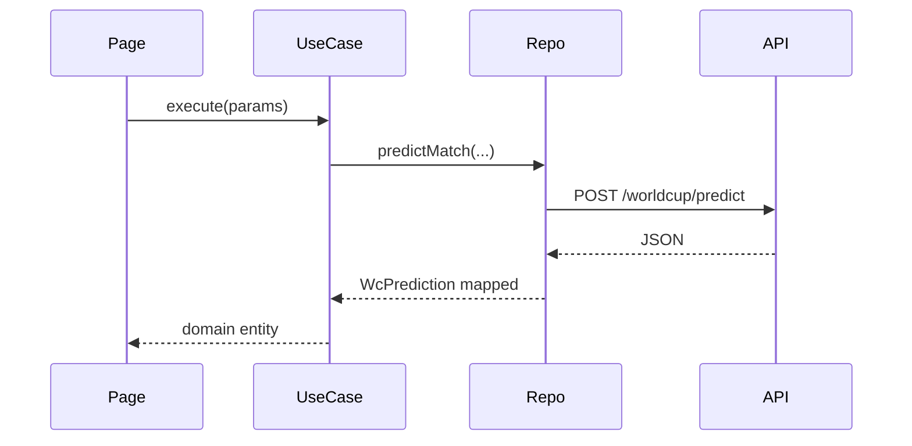

# Frontend — Bolão AI

Plataforma web em [`frontend/`](../frontend/) consumindo a API FastAPI.

## Stack

| Tecnologia | Uso |
|------------|-----|
| React 18 + TypeScript | UI |
| Vite 6 | Build e dev server |
| Tailwind CSS | Tema dark neon, glassmorphism |
| ApexCharts | Donut, barras (probabilidades) |
| Framer Motion | Transições e animações |
| TanStack Query | Cache e fetching |
| React Router 7 | Rotas |

## Rotas

| Rota | Página | Descrição |
|------|--------|-----------|
| `/` | DashboardPage | Rodada WC, cards de jogos, value bets |
| `/news` | NewsFeedPage | Feed de notícias + sync |
| `/predict` | PredictPage | Palpite avulso (times, fase, KXL) |
| `/validate` | HistoricalValidationPage | Backtest por edição/jogo |
| `/brasileirao` | BrasileiraoPage | Rodada Brasileirão |
| `/match/:home/:away` | MatchDetailPage | Análise completa de um jogo |

## Arquitetura (Clean)

```
src/
├── domain/
│   ├── entities/           # WcPrediction, ModelBreakdown, GoalModelFactors...
│   └── repositories/       # Interfaces IWcRepository, IHistoricalValidationRepository...
├── application/
│   ├── use-cases/          # PredictWcMatchUseCase, GetValueBetsUseCase...
│   └── container.ts        # Injeção de dependências
├── infrastructure/
│   ├── api/client.ts       # apiFetch (base /api)
│   ├── mappers/            # snake_case API → camelCase domain
│   └── repositories/       # Implementações HTTP
└── presentation/
    ├── pages/
    ├── components/
    │   ├── charts/         # ProbabilityDonut, ModelBreakdownChart
    │   ├── predictions/    # MatchCard, ValueBetCard, PoissonFactorsPanel...
    │   ├── historical/     # HistoricalMatchPicker
    │   └── layout/         # AppLayout, PageTransition
    └── theme/              # Cores, formatPercent
```

## Componentes principais

| Componente | Função |
|----------|--------|
| `MatchCard` | Card de jogo na dashboard |
| `ProbabilityDonut` | Gráfico rosca 1/X/2 |
| `ModelBreakdownChart` | Barras Dixon-Coles vs Logística |
| `PoissonFactorsPanel` | λ, ataque/defesa, ρ |
| `ValueBetCard` | Entradas com EV positivo |
| `PitchHeatmap` | Gramado interativo (KXL) |
| `LethalityGkPanel` | Letalidade × goleiro |
| `MatchContextPanel` | Contexto IA parseado |
| `HistoricalMatchPicker` | Seletor edição + jogo |

## Fluxo de dados



## Desenvolvimento

Ver [instalacao-e-configuracao.md](instalacao-e-configuracao.md).

```bash
cd frontend
npm install
npm run dev
```

Banner **API offline** aparece no header se `/health` falhar.

## Build produção

```bash
npm run build    # tsc + vite → frontend/dist/
npm run preview
```

## Mapeamento API → UI

| Campo API | Entidade UI |
|-----------|-------------|
| `model_breakdown.dixon_coles` | `modelBreakdown.dixonColes` |
| `model_breakdown.poisson_factors` | `modelBreakdown.poissonFactors` |
| `poisson_score` | `poissonScore` |
| `kxl_collision` | Painéis gramado / letalidade |

Compatibilidade retroativa: mappers aceitam chave `poisson` como alias de `dixon_coles`.

## Personalização visual

- Cores neon: `tailwind.config.js` (`neon-green`, `neon-blue`, `neon-purple`)
- Classe utilitária `glass-card` para cartões com blur
- Fonte mono para métricas numéricas (λ, ρ, EV)

Mais detalhes: [`frontend/README.md`](../frontend/README.md).
