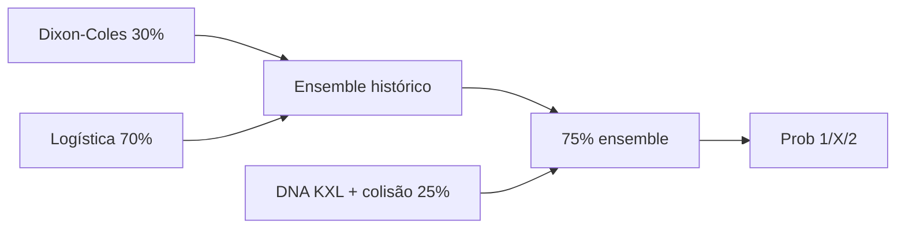

# Modelos preditivos

## Visão do ensemble (Copa do Mundo)

O palpite final combina **quatro famílias** de sinal:



Implementação: [`models/wc_predictor.py`](../models/wc_predictor.py).

---

## 1. Dixon-Coles (gols)

**Arquivos:** [`models/poisson_wc.py`](../models/poisson_wc.py), [`models/dixon_coles_wc.py`](../models/dixon_coles_wc.py)

### Lambda (λ) — gols esperados

\[
\lambda_{home} = \text{média\_liga} \times \text{ataque}_h \times \text{defesa}_a + \text{mando} \times \text{fator}_{Elo}
\]

| Parâmetro | Descrição |
|-----------|-----------|
| `league_avg` | Média de gols por jogo no histórico WC |
| `home_attack`, `away_attack` | Força ofensiva relativa |
| `home_defense`, `away_defense` | Força defensiva relativa |
| `HOME_ADV_GOALS` | +0,15 gols mandante |
| `rho` (ρ) | Correção Dixon-Coles em placares baixos |

### Correção τ (Dixon & Coles, 1997)

| Placar | τ |
|--------|---|
| 0×0 | \(1 - \lambda_h \lambda_a \rho\) |
| 0×1 | \(1 + \lambda_h \rho\) |
| 1×0 | \(1 + \lambda_a \rho\) |
| 1×1 | \(1 - \rho\) |
| outros | 1 |

ρ é estimado por **máxima verossimilhança** no conjunto de treino (exclui holdout 2022).

### Saída

- Probabilidades `1` / `X` / `2`
- Placar provável (`poisson_score`)
- Fatores expostos em `model_breakdown.poisson_factors`

---

## 2. Regressão logística

**Arquivo:** [`models/logistic_wc.py`](../models/logistic_wc.py)

Features ([`pipelines/wc_stats.py`](../pipelines/wc_stats.py)):

- Elo mandante/visitante e diferença
- H2H em Copas (vitórias, empates)
- Taxa de gols marcados/sofridos
- Forma recente (string `V/E/D`)
- Fase mata-mata (flag)

Usa **softmax** multiclasse via `sklearn.linear_model.LogisticRegression` → equivalente a sigmoides por classe.

Holdout: acurácia na Copa **2022** (`holdout_2022_accuracy`).

---

## 3. Elo

**Arquivo:** [`pipelines/wc_stats.py`](../pipelines/wc_stats.py)

Expectativa de resultado (forma sigmoide):

\[
E_A = \sigma\left(\frac{R_A - R_B}{400} \ln 10\right)
\]

Implementação explícita em [`models/math_utils.py`](../models/math_utils.py) (`sigmoid`).

---

## 4. Ensemble colaborativo

**Arquivo:** [`models/wc_collaborative.py`](../models/wc_collaborative.py)

- Calibra pesos Dixon-Coles vs logística na temporada **2022**
- Otimiza **Brier score** (grid 0–100% em passos de 5%)
- Pesos típicos: ~30% DC, ~70% logística

---

## 5. Baselines KXL (DNA tático)

**Arquivos:** [`pipelines/wc_baselines.py`](../pipelines/wc_baselines.py), `data/wc/team_baselines.json`

- Vetores por seleção: energia, controle, defesa, etc.
- **Blend 25%** com probabilidades do ensemble histórico
- Matchup setorial no texto de contexto

Import:

```bash
python3 scripts/import_wc_baselines.py "/caminho/baselines.txt"
```

---

## 6. Motor de colisão KXL

**Arquivo:** [`pipelines/wc_kxl_collision.py`](../pipelines/wc_kxl_collision.py)

Pilares **Energia / Espaço / Tempo** → vetores **Vcar**, **Vesc**, letalidade×GK, **EACP**.

Entrada dinâmica opcional (`kxl_match`): blocos **FECL**, **FEJU**, **FEDE**, **FEPT**, **FEEM**.

Documentação detalhada: [kxl-colisao.md](kxl-colisao.md).

Calibração holdout:

```bash
python3 scripts/wc_kxl_calibrate.py --season 2022
```

---

## 7. Expected Value (odds)

**Arquivos:** [`models/ev_value.py`](../models/ev_value.py), [`ingest/odds/the_odds_api.py`](../ingest/odds/the_odds_api.py)

Para cada outcome:

\[
EV = p_{modelo} \times odd - 1
\]

Também: implied prob, fair odd, Kelly fracionado (¼).

---

## 8. Baseline Brasileirão (notícias)

**Arquivo:** [`models/baseline.py`](../models/baseline.py)

Heurística ponderada: posição na tabela, forma, H2H, sentimento RSS, desfalques. **Não usa sigmoide** — limiares fixos em score contínuo.

---

## Validação temporal

| Mecanismo | Uso |
|-----------|-----|
| `before_date` em features | Exclui jogos futuros do histórico |
| `POST /worldcup/validate` | Backtest jogo a jogo |
| Holdout 2022 | Calibra ensemble e logística |
| `benchmark-wc-models` | Compara Poisson, logística, GB, blend |

---

## Métricas

| Métrica | Descrição |
|---------|-----------|
| **Accuracy** | % palpites corretos (classe modal) |
| **Brier score** | Calibração probabilística (menor = melhor) |
| **Log loss** | Penaliza confiança errada |

Relatório: `data/lake/reports/wc_benchmark_report.json`.
