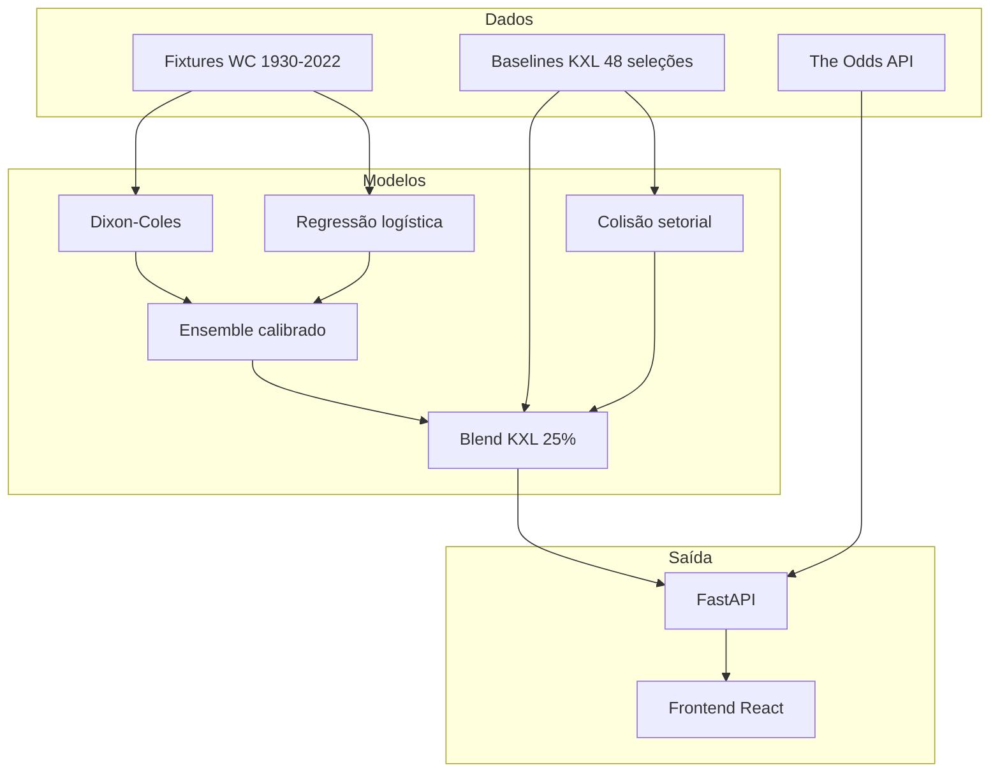
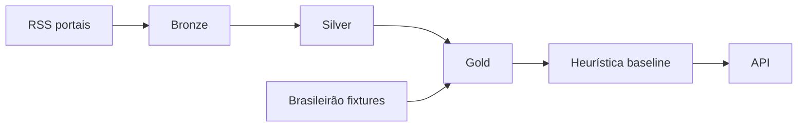

# Visão geral

## O que é o projeto

O **api_noticia** (marca UI: **Bolão AI**) é uma plataforma para:

1. **Coletar** notícias esportivas de portais brasileiros (RSS)
2. **Transformar** dados em camadas analíticas (datalake bronze → silver → gold)
3. **Prever** resultados de bolão (**1** = vitória mandante, **X** = empate, **2** = vitória visitante)
4. **Validar** modelos em jogos históricos da Copa do Mundo
5. **Cruzar** probabilidades com odds reais (expected value)
6. **Exibir** tudo em dashboard web com gráficos e contexto IA

## Público-alvo

- Analistas e entusiastas de bolão
- Desenvolvedores que estendem pipelines de dados esportivos
- Pesquisa em modelos híbridos (estatística + contexto tático KXL + notícias)

## Formato bolão

| Código | Significado |
|--------|-------------|
| `1` | Vitória do mandante |
| `X` | Empate |
| `2` | Vitória do visitante |

## Fluxo principal (Copa do Mundo)

## Fluxo principal (Brasileirão)

## Capacidades por módulo

| Módulo | Função |
|--------|--------|
| **Ingestão** | RSS, import Brasileirão/Copa, odds ao vivo |
| **Pipelines** | Silver/gold, palpites rodada, validação histórica |
| **Modelos** | Dixon-Coles, logística, Elo, KXL, EV |
| **API** | REST JSON, CORS, warmup de modelos na subida |
| **Frontend** | Dashboard, palpite, validação, notícias, value bets |

## Roadmap (README principal)

- Fine-tuning de LM com JSONL gold
- NER de jogadores
- BigQuery/GCS para escala
- Orquestração (Prefect / Composer)
